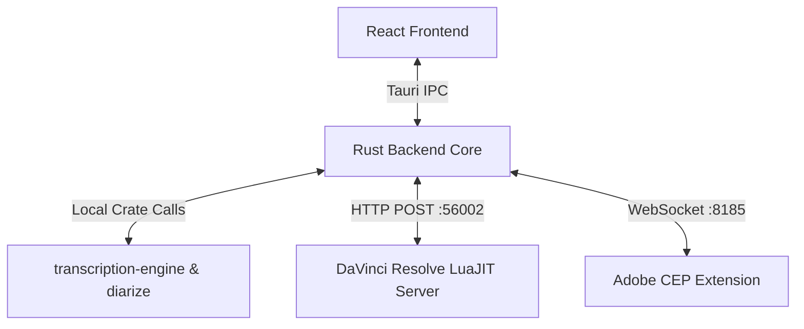

# 🤖 Agent's Lay of the Land (AGENTS.md)

> **Note:** This document is primarily intended for AI agents working on the AutoSubs codebase. For general documentation, see the [main README](README.md), [Contributing Guide](CONTRIBUTING.md), or [AutoSubs-App README](AutoSubs-App/README.md).

AutoSubs is a local-first desktop application that generates accurate, timestamped, and speaker-labeled subtitles from audio or video files. It runs standalone or integrates directly with video editors (DaVinci Resolve and Adobe Premiere Pro/After Effects) using local network bridges.

---

## 🧭 System Topology & Bridge Ports

AutoSubs uses a local-first **Tauri v2 (Rust + React)** app communicating with host editors via dedicated loopback bridges:

---

## ⚠️ High-Context & Tricky Architecture Details

### 1. The DaVinci Resolve Bridge (Port `56002`)
* **The Server**: Runs directly inside Resolve's LuaJIT environment, powered by [ljsocket.lua](AutoSubs-App/src-tauri/resources/modules/ljsocket.lua).
* **The Gotcha**: The frontend does *not* talk to the Lua server directly. Tauri's webview HTTP plugin hangs when processing Resolve's short, unbuffered `Connection: close` responses.
* **The Solution**: All HTTP traffic is proxied through the Rust backend command `resolve_bridge` ([resolve_bridge.rs](AutoSubs-App/src-tauri/src/resolve_bridge.rs)) using `reqwest`.
* **Documentation**: Comprehensive documentation of the Resolve integration architecture, Lua server API, Fusion macro system, and development workflow is available in [Resolve Integration/README.md](Resolve%20Integration/README.md).

### 2. Local AI Execution & Cargo Features
* **Engines**: Transcription is handled by `whisper-rs` (C++ bindings) and `transcribe-rs` (ONNX via `ort` for Moonshine/Parakeet). Diarization is a custom Pyannote port in Rust ([diarize](AutoSubs-App/src-tauri/crates/diarize)).
* **Platform Features**: Acceleration requires explicit Cargo features during compile-time:
  * **macOS (Apple Silicon)**: `--features mac-aarch` (Metal + CoreML).
  * **Windows**: `--features windows` (Vulkan + DirectML).
  * **Linux**: `--features linux` (Vulkan).
* **How to Run/Build**: Dev and build commands inside `AutoSubs-App/` pass these flags automatically:
  * **Unified Dev Mode**: `npm run dev` (cross-platform OS & architecture detector).
  * **Targeted Dev Mode**: `npm run dev:mac:arm64`, `npm run dev:mac:x86_64`, `npm run dev:win`, or `npm run dev:linux`.
  * **Build Production**: `npm run build:mac:arm64` (Mac ARM), `npm run build:mac:x86_64` (Mac Intel), `npm run build:win` (Windows), or `npm run build:linux` (Linux).

### 3. DaVinci Resolve Sandboxing & Wide Characters (Windows)
* Resolve's Lua engine is sandboxed. On Windows, file access fails on paths containing special or non-ASCII characters if standard Lua `io.open` is used.
* **Solution**: [AutoSubs.lua](AutoSubs-App/src-tauri/resources/AutoSubs.lua) uses LuaJIT FFI to declare and invoke native Windows APIs (`MultiByteToWideChar` and `_wfopen`) to safely handle file encodings.
* **Fusion Macro**: The animated caption macro is stored at [Resolve Integration/autosubs-macro.setting](Resolve%20Integration/autosubs-macro.setting). See [Resolve Integration/README.md](Resolve%20Integration/README.md) for editing instructions and workflow.

### 4. Adobe CEP WebSocket Bridge (Port `8185`)
* Communicates with Adobe Premiere Pro and After Effects through the bundled CEP extension ([Adobe-Extension](Adobe-Extension)).
* **Tricky Detail**: The extension launches a WebSocket client connecting to the Tauri app's built-in server ([adobe_bridge.rs](AutoSubs-App/src-tauri/src/adobe_bridge.rs)) to coordinate timeline audio exports and subtitle imports.
* **Documentation**: The Adobe extension has excellent documentation at [Adobe-Extension/README.md](Adobe-Extension/README.md).

### 5. Error Propagation Across the Boundary
* **The Gotcha**: Because transcription and diarization run fully locally across multiple sub-crates, native C/C++ exceptions and ONNX load errors can easily crash the backend.
* **The Rule**: All internal crate errors must bubble up explicitly as standard Rust `Result<T, String>` or `eyre::Result` types, which Tauri command handlers serialize into rejected JS promises so the React UI can gracefully display error dialogs.

---

## ⚡ Development Cheatsheet

Always install dependencies inside `AutoSubs-App/` and compile using these target-specific flags:

| Action | Working Directory | Command |
| :--- | :--- | :--- |
| **Run Dev Mode (Auto)** | `AutoSubs-App/` | `npm run dev` |
| **Run Dev (Linux/Win)** | `AutoSubs-App/` | `npm run dev:linux` / `npm run dev:win` |
| **Build Web Assets** | `AutoSubs-App/` | `npm run build:web` |
| **Build Adobe CEP** | `Adobe-Extension/` | `npm run build` |

---

## Related Documentation

- **[Main README](README.md)** - Installation and general usage
- **[Contributing Guide](CONTRIBUTING.md)** - Development setup and contribution workflow
- **[AutoSubs-App README](AutoSubs-App/README.md)** - Technical architecture and code organization
- **[CLI Guide](CLI.md)** - Command-line interface reference
- **[Resolve Integration](Resolve%20Integration/README.md)** - DaVinci Resolve integration architecture and development
- **[Adobe Extension](Adobe-Extension/README.md)** - Adobe Premiere Pro/After Effects integration details
