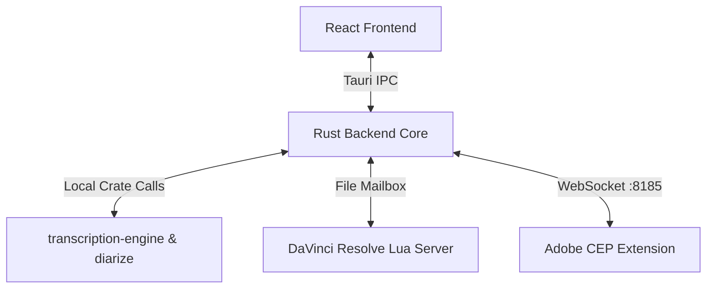

# 🤖 Agent's Lay of the Land (AGENTS.md)

> **Note:** This document is primarily intended for AI agents working on the AutoSubs codebase. For general documentation, see the [main README](README.md), [Contributing Guide](CONTRIBUTING.md), or [AutoSubs-App README](AutoSubs-App/README.md).

AutoSubs is a local-first desktop application that generates accurate, timestamped, and speaker-labeled subtitles from audio or video files. It runs standalone or integrates directly with video editors (DaVinci Resolve and Adobe Premiere Pro/After Effects) using local network bridges.

---

## 🧭 System Topology & Bridge Ports

AutoSubs uses a local-first **Tauri v2 (Rust + React)** app communicating with host editors via dedicated loopback bridges:


```mermaid
flowchart TD
    ReactFE[React Frontend] <-->|Tauri IPC| RustBE[Rust Backend Core]
    RustBE <-->|Local Crate Calls| AICrates[transcription-engine & diarize]
    RustBE <-->|File Mailbox| Resolve[DaVinci Resolve Lua Server]
    RustBE <-->|WebSocket :8185| Adobe[Adobe CEP Extension]
```

---

## ⚠️ High-Context & Tricky Architecture Details

### 1. The DaVinci Resolve Bridge (File Mailbox)
* **Why not sockets**: Resolve 21.1 (free edition) sandboxes the Lua state that runs Workspace > Scripts scripts — `io`, `ffi`, `package`, `require`, `os.execute` and `bmd.readdir` are all nil, so the old `ljsocket` HTTP server on port 56002 is gone for good. Lua code must never touch those globals.
* **Rust → Lua**: [resolve_bridge.rs](AutoSubs-App/src-tauri/src/resolve_bridge.rs) atomically writes `request.lua` (a `return { id = "...", body = [==[<json>]==] }` chunk) into `<data_local_dir>/com.autosubs/resolve-bridge`; the Lua loop in [autosubs_core.lua](AutoSubs-App/src-tauri/resources/modules/autosubs_core.lua) picks it up with `loadfile`. Payloads with a `filePath` get the file's parsed JSON attached as `subtitleData` because Lua can't read files.
* **Lua → Rust**: Lua acks with `fusion:SetPrefs("Global.AutoSubsBridge.Ack", id)` and answers with `Response = "<id>:<base64 json>"`, flushing via `SavePrefs()`; Rust polls `Fusion/Profiles/*/Fusion.prefs`.
* **Module loading**: `require` doesn't exist — [bootstrap.lua](AutoSubs-App/src-tauri/resources/modules/bootstrap.lua) installs `AutoSubs_require` (loadfile + cache) and detects the platform/mailbox path. Entry scripts just `loadfile` it.
* **Script install owned by the app**: release builds write `Utility/AutoSubs.lua` + `AutoSubs.scriptlib` into the user's Resolve Scripts folder at startup ([resolve_scripts.rs](AutoSubs-App/src-tauri/src/resolve_scripts.rs)) from bundled `[[...]]`-placeholder templates, regenerating only when content changes — so updater installs refresh them without a reinstall. Dev builds skip it (the dev scriptlib would fight them).
* **Zero-click startup**: Resolve runs `Fusion/Scripts/*.scriptlib` at launch; [AutoSubs.scriptlib](AutoSubs-App/src-tauri/resources/AutoSubs.scriptlib) hands the bootstrap to `fusion:Execute()`, so a resident bridge loop starts with Resolve itself — the app never starts or stops it.
* **One loop at a time**: the loop writes `Global.AutoSubsBridge.Heartbeat` (in-memory prefs, no SavePrefs) every second; launchers probe it via `bridge_alive()`, then claim `Owner` with a unique token (last-writer-wins after a settle window). The Utility/Dev scripts launch with `mode = "manual"` (takeover: set `Stop` to now, wait for the old loop to clear it, start fresh); the scriptlib uses `mode = "startup"` (skip if already alive). `Stop` is timestamped — a loop exits only when it's newer than the loop's own start, so a takeover aimed at a busy predecessor still lands and never kills the replacement. Each mailbox request is claimed via `Global.AutoSubsBridge.Claim`, so two briefly-coexisting loops can't handle the same request twice.
* **Documentation**: See [Resolve-Integration/README.md](Resolve-Integration/README.md).

### 2. Local AI Execution & Cargo Features
* **Engines**: Transcription is handled by `whisper-rs` (C++ bindings) and `transcribe-rs` (ONNX via `ort` for Moonshine/Parakeet). Diarization is a custom Pyannote port in Rust ([diarize](AutoSubs-App/src-tauri/crates/diarize)).
* **Platform Features**: Acceleration requires explicit Cargo features during compile-time:
  * **macOS (Apple Silicon)**: `--features mac-aarch` (Metal + CoreML).
  * **Windows**: `--features windows` (Vulkan + DirectML).
  * **Linux**: `--features linux` (Vulkan).
* **How to Run/Build**: Dev and build commands inside `AutoSubs-App/` pass these flags automatically:
  * **Unified Dev Mode**: `npm run dev` (cross-platform OS & architecture detector).
  * **Targeted Dev Mode**: `npm run dev:mac:arm64`, `npm run dev:mac:x86_64`, `npm run dev:win`, or `npm run dev:linux`.
  * **Build Production**: `npm run build:mac:arm64` (Mac ARM), `npm run build:mac:x86_64` (Mac Intel), `npm run build:win` (Windows), or `npm run build:linux` (Linux).


### 3. DaVinci Resolve Sandboxing
* Resolve's Lua engine is heavily sandboxed (see section 1): no `io`, `ffi`, `package`, `require`, `os.execute` or `bmd.readdir`. File I/O therefore happens on the Rust side; paths from `os.getenv` are ANSI-codepage bytes on Windows, which is what `loadfile`/file APIs expect — don't convert them.
* **Fusion Macro**: The animated caption macro is stored at [Resolve-Integration/autosubs-macro.setting](Resolve-Integration/autosubs-macro.setting). See [Resolve-Integration/README.md](Resolve-Integration/README.md) for editing instructions and workflow.

### 3b. Caption styles: two kinds, two owners

AutoSubs sends captions either as its own bundled Fusion macro (animated, word by word, styled by a preset the app stores) or as any Text+ / Fusion title already in the user's media pool (styled in Resolve). Nearly every caption bug comes from code that handles one and forgets the other.

Two files own that difference, and new code belongs in them rather than beside them:

* **[modules/caption_style.lua](AutoSubs-App/src-tauri/resources/modules/caption_style.lua)** — which kind a comp holds, how text and word timings go in, how preset values are read and written, how a speaker's colour is applied. `AddSubtitles`, `BatchApplyStyle` and `GeneratePreview` all call into it; they used to carry three copies of the branch and had already drifted apart.
* **[src/lib/caption-style.ts](AutoSubs-App/src/lib/caption-style.ts)** — the `CaptionStyle` union that is the single answer to "what will Send put on the timeline", plus what to send for it.

Two rules worth knowing before changing anything here:

* **The look is edited in Fusion, never mirrored in React.** The macro's inspector is the editing UI and Resolve's viewer is the only thing that can play the animation. The app owns the preset *library* (name, thumbnail, import/export, per speaker colour) and nothing else. A control added to the macro must not need a second implementation in the app.
* **Unknown preset keys are skipped, and that is the whole compatibility story.** `SetInputValues` only applies keys the installed macro declares in `InputKeys`, so presets degrade across macro versions on their own. There is no preset versioning and no migration; do not add one.

See [Resolve-Integration/docs/caption-styles.md](Resolve-Integration/docs/caption-styles.md) for the full picture.

### 4. Adobe CEP WebSocket Bridge (Port `8185`)
* Communicates with Adobe Premiere Pro and After Effects through the bundled CEP extension ([Adobe-Extension](Adobe-Extension)).
* **Tricky Detail**: The extension launches a WebSocket client connecting to the Tauri app's built-in server ([adobe_bridge.rs](AutoSubs-App/src-tauri/src/adobe_bridge.rs)) to coordinate timeline audio exports and subtitle imports.
* **Documentation**: The Adobe extension has excellent documentation at [Adobe-Extension/README.md](Adobe-Extension/README.md).

### 5. Error Propagation Across the Boundary
* **The Gotcha**: Because transcription and diarization run fully locally across multiple sub-crates, native C/C++ exceptions and ONNX load errors can easily crash the backend.
* **The Rule**: All internal crate errors must bubble up explicitly as standard Rust `Result<T, String>` or `eyre::Result` types, which Tauri command handlers serialize into rejected JS promises so the React UI can gracefully display error dialogs.

### 6. UI Copy & Translations (i18n)

All user-facing strings live in `AutoSubs-App/src/i18n/locales/<lang>/translation.json` across **8 locales**: `de`, `en`, `es`, `fr`, `ja`, `ko`, `ru`, `zh`.

* **Never add an English-only key.** Every new key must land in all 8 files in the same change, or the other locales silently fall back to the raw key. The same goes for deletions — when UI is removed, strip the orphaned keys from all 8.
* **Length is a hard constraint, and it applies per language.** Settings rows use `ItemDescription` ([item.tsx](AutoSubs-App/src/components/ui/item.tsx)), which combines `text-balance` with `line-clamp-*`. Two failure modes follow:
  * Past roughly **60 characters** the row wraps, and because of `text-balance` it does *not* fill the first line — it splits into two evenly-sized short lines, which looks broken rather than merely long.
  * Past the `line-clamp` limit the text is silently truncated with an ellipsis, losing information entirely.
* **Budget**: descriptions ≤ **60 characters**, titles ≤ **25 characters** — measured in *every* locale, not just English.
* **Translate to fit, not literally.** `de`, `es`, `fr` and `ru` routinely run 20–30% longer than English, so a comfortable 50-char English string becomes a wrapping 65-char German one. Shorten the wording for those locales instead of preserving English sentence structure; a terser phrasing that fits beats a faithful one that wraps.
* **No em dashes (`—`) or en dashes (`–`) in UI strings.** Use a comma, a period, or parentheses.
* **Write for non-technical video editors.** Prefer the plain-language name over the technical one (the DTW toggle is labelled "Whisper Word Refinement", not "Dynamic Time Warping"). Jargon in a settings row is a bug.
* **When one string references another feature, use that locale's own title** for it, not the English name.
* **Edit all 8 files with a script**, not one at a time — it is the only reliable way to keep them in sync. Preserve the existing format: 2-space indent, `ensure_ascii=False`, trailing newline.

Check the budget before considering the work done:

```bash
cd AutoSubs-App && python3 -c "
import json, glob
for f in sorted(glob.glob('src/i18n/locales/*/translation.json')):
    lang = f.split('/')[-2]
    def walk(o, p=''):
        if isinstance(o, dict):
            for k, v in o.items(): walk(v, f'{p}.{k}')
        elif isinstance(o, str):
            if len(o) > 60: print(f'{lang} {len(o):4} {p}')
            if '—' in o or '–' in o: print(f'{lang} DASH {p}')
    walk(json.load(open(f, encoding='utf-8')))
"
```

Long-form strings (dialog bodies, error messages, onboarding) legitimately exceed 60 characters — the budget applies to compact UI: settings rows, toggle descriptions, buttons, badges, and menu items.

---

## ⚡ Development Cheatsheet

Always install dependencies inside `AutoSubs-App/` and compile using these target-specific flags:

| Action | Working Directory | Command |
| :--- | :--- | :--- |
| **Run Dev Mode (Auto)** | `AutoSubs-App/` | `npm run dev` |
| **Run Dev (Linux/Win)** | `AutoSubs-App/` | `npm run dev:linux` / `npm run dev:win` |
| **Build Web Assets** | `AutoSubs-App/` | `npm run build:web` |
| **Build Adobe CEP** | `Adobe-Extension/` | `npm run build` |
| **Syntax-check Lua** | repo root | `luajit -bl AutoSubs-App/src-tauri/resources/modules/autosubs_core.lua /dev/null` |

`luac` is not installed on macOS — use `luajit -bl <file> /dev/null` to parse without executing (the files reference Resolve's globals at load time, so they cannot simply be run). `luajit` also matches Resolve's embedded LuaJIT runtime, unlike stock `lua`.

---

## Related Documentation

- **[Main README](README.md)** - Installation and general usage
- **[Contributing Guide](CONTRIBUTING.md)** - Development setup and contribution workflow
- **[AutoSubs-App README](AutoSubs-App/README.md)** - Technical architecture and code organization
- **[CLI Guide](CLI.md)** - Command-line interface reference
- **[Resolve Integration](Resolve-Integration/README.md)** - DaVinci Resolve integration architecture and development
- **[Caption Styles](Resolve-Integration/docs/caption-styles.md)** - the two caption kinds, presets, and the Fusion editing round trip
- **[Adobe Extension](Adobe-Extension/README.md)** - Adobe Premiere Pro/After Effects integration details
