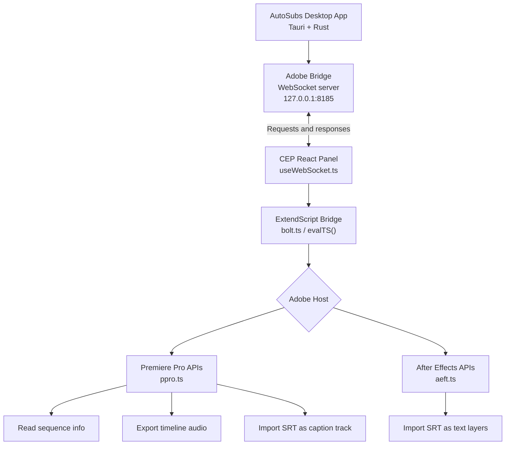

# AutoSubs Adobe Extension

This package contains the Adobe CEP extension that lets AutoSubs communicate with Adobe Premiere Pro and After Effects. It provides a small React-based panel inside Adobe apps and a compiled ExtendScript layer that performs host-specific operations such as reading sequence metadata, exporting timeline audio, and importing generated subtitle files.

## Documentation

- **[Main README](../README.md)** - Installation and general usage
- **[Contributing Guide](../CONTRIBUTING.md)** - Development setup and contribution workflow
- **[AutoSubs-App README](../AutoSubs-App/README.md)** - Technical architecture and code organization
- **[Resolve Integration](../Docs/resolve_integration.md)** - DaVinci Resolve integration architecture and development

## High-level architecture



This separation keeps the desktop app independent from Adobe's scripting runtime while still allowing AutoSubs to control timeline export and subtitle import through the installed CEP extension.

## How it fits into AutoSubs

The extension acts as a bridge between three environments:

- **AutoSubs desktop app**  
  Runs the main Tauri application and starts a local WebSocket server on `127.0.0.1:8185`.

- **CEP panel**  
  Runs inside Adobe as a browser-based React UI. It connects to the AutoSubs desktop app over WebSocket.

- **ExtendScript host layer**  
  Runs inside Premiere Pro or After Effects through Adobe's scripting bridge. This layer calls Adobe APIs that are not directly available to the React panel.

In practice, the desktop app sends requests to the CEP panel, the panel forwards those requests to ExtendScript, and ExtendScript performs the operation inside Premiere Pro or After Effects.

## Startup flow

The extension starts from `src/js/main/index-react.tsx`.

On launch:

1. The React app mounts.
2. `initBolt()` loads the compiled ExtendScript bundle.
3. The ExtendScript entry point detects the current Adobe host.
4. Premiere functions are attached to the shared AutoSubs namespace when the host is Premiere Pro.
5. The React panel opens a WebSocket connection to the AutoSubs desktop app.

Key files:

- `src/js/main/index-react.tsx`  
  React entry point.

- `src/js/lib/utils/bolt.ts`  
  Loads the compiled ExtendScript file and provides the `evalTS()` bridge used to call ExtendScript functions.

- `src/jsx/index.ts`  
  Detects the host app and maps Premiere or After Effects functions into the shared namespace.

- `src/js/main/useWebSocket.ts`  
  Owns the connection to the AutoSubs desktop app and routes incoming requests.

## WebSocket connection

The AutoSubs desktop app starts a WebSocket server from `AutoSubs-App/src-tauri/src/adobe_bridge.rs`.

The server listens on:

```text
127.0.0.1:8185
```

The CEP panel connects to that port from `useWebSocket.ts`. Once connected, it sends a handshake identifying itself as either:

- `premiere`
- `aftereffects`

The desktop app stores that connection so it can route future integration requests to the correct Adobe host.

After the handshake, the extension immediately refreshes the active sequence information so the desktop app can display the current Premiere timeline state.

## Calling Premiere from the CEP panel

The CEP panel cannot directly use most Premiere scripting APIs. Instead, it calls ExtendScript through `evalTS()`.

The general flow is:

```text
AutoSubs desktop app
  -> WebSocket request
  -> CEP panel message handler
  -> evalTS("functionName", args)
  -> ExtendScript function
  -> Premiere Pro API
  -> JSON result
  -> WebSocket response
  -> AutoSubs desktop app
```

`evalTS()` is implemented in `src/js/lib/utils/bolt.ts`. It serializes arguments, evaluates the requested function inside the Adobe scripting context, and returns the result to the React layer.

## Sequence info flow

When the extension connects, it requests active sequence metadata from Premiere.

The relevant function is:

```text
getActiveSequenceInfo()
```

Flow:

1. `useWebSocket.ts` calls `evalTS("getActiveSequenceInfo")`.
2. `bolt.ts` forwards the call into ExtendScript.
3. `src/jsx/ppro/ppro.ts` reads `app.project.activeSequence`.
4. Premiere sequence metadata is collected, including name, duration, resolution, timebase, and track information.
5. The result is returned as JSON and stored in React state.

This is used by AutoSubs to understand which sequence is active and which audio tracks are available for export.

## Audio export flow

When AutoSubs needs timeline audio for transcription, the desktop app sends an audio export request to the extension.

The relevant function is:

```text
exportSequenceAudio(...)
```

Flow:

1. `useWebSocket.ts` receives an export request over WebSocket.
2. It calls `evalTS("exportSequenceAudio", ...)`.
3. `ppro.ts` resolves the bundled WAV export preset.
4. Premiere's QE DOM is enabled for track-level mute and solo control.
5. The selected audio tracks are soloed or unmuted.
6. If a clip range was requested, temporary sequence in/out points are set.
7. Premiere exports audio using `sequence.exportAsMediaDirect(...)`.
8. A `finally` block restores the original sequence in/out points and track states.
9. The CEP panel sends the export result back to the AutoSubs desktop app.

The exported file is a WAV file that AutoSubs can then process for transcription.

## SRT import flow

After AutoSubs generates subtitles, the desktop app can send an SRT import request to the extension.

The relevant Premiere function is:

```text
importSRTFile(filePath)
```

Flow:

1. `useWebSocket.ts` receives a `request_import_srt` message.
2. It calls `evalTS("importSRTFile", filePath)`.
3. `ppro.ts` imports the SRT file into the Premiere project bin with `app.project.importFiles(...)`.
4. The imported project item is located.
5. `sequence.createCaptionTrack(...)` creates a caption track from the SRT file.
6. The result is sent back to the desktop app over WebSocket.

For After Effects, the SRT import path is different. The extension reads and parses the SRT file manually, then creates individual text layers inside the active composition.

## Build and deployment

The extension build has two main outputs:

- **CEP panel UI**  
  Built with Vite from the React/TypeScript source.

- **ExtendScript bundle**  
  Built with Rollup and transpiled for Adobe's ExtendScript environment.

Build command:

```bash
npm run build
```

The build process:

1. Clears the previous `dist` output.
2. Compiles TypeScript.
3. Builds the React CEP panel with Vite.
4. Builds the ExtendScript bundle with Rollup.
5. Copies the built extension into the Tauri app resources folder.

The copy step is handled by:

```text
scripts/copy-to-resources.js
```

The extension is copied into:

```text
AutoSubs-App/src-tauri/resources/com.autosubs.adobe/
```

During the Tauri app build, the `resources/` folder is bundled into the desktop app.

On Windows, the installer copies the bundled CEP extension into Adobe's CEP extensions directory and enables `PlayerDebugMode` registry keys so the unsigned extension can run.

## Important files

- `src/js/main/useWebSocket.ts`  
  Connects to AutoSubs, handles requests, calls ExtendScript, and sends responses.

- `src/js/lib/utils/bolt.ts`  
  Provides the bridge between the CEP JavaScript environment and ExtendScript.

- `src/jsx/index.ts`  
  Detects the Adobe host and maps host-specific functions.

- `src/jsx/ppro/ppro.ts`  
  Premiere Pro implementation for sequence info, audio export, and SRT import.

- `src/jsx/aeft/aeft.ts`  
  After Effects implementation, including SRT-to-text-layer import.

- `scripts/copy-to-resources.js`  
  Copies the built extension into the Tauri resources directory.
