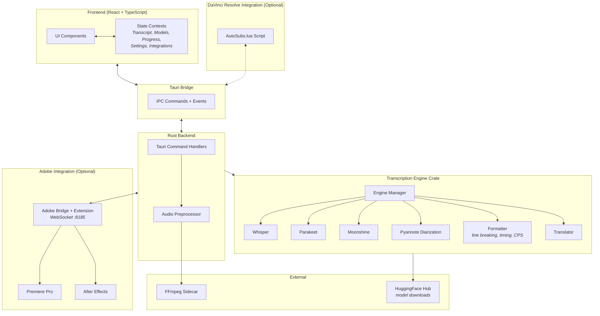

# AutoSubs App

A cross-platform desktop app for generating subtitles with speaker diarization, translation, DaVinci Resolve integration, and Adobe Premiere Pro / After Effects integration via the bundled CEP extension — powered by AI transcription models running locally on your machine.

## Tech Stack

- **Frontend:** React + TypeScript (Vite)
- **Desktop Framework:** Tauri 2
- **Backend:** Rust (async via Tokio)
- **Transcription:** Whisper, Parakeet, Moonshine (via whisper-rs / ONNX Runtime)
- **Speaker Diarization:** Pyannote
- **Translation:** Google Translate API
- **Audio Processing:** FFmpeg (bundled sidecar)

## Architecture Overview



**How a transcription works end-to-end:**
1. User selects a file and clicks Transcribe
2. Rust backend preprocesses audio via FFmpeg (normalization, format conversion)
3. Transcription engine runs the chosen AI model (Whisper / Parakeet / Moonshine) locally
4. Optionally runs Pyannote for speaker diarization and Google Translate for translation
5. Formatter applies line-breaking, timing constraints, and language-specific rules
6. Results stream back to the UI in real time; user edits and exports

---

## Key Directories

| Directory | Purpose |
|---|---|
| `src/` | React frontend — components, contexts, hooks, utilities |
| `src/components/` | UI organized by feature (transcription, subtitles, settings, processing) |
| `src/contexts/` | Global state management (transcript, progress, models, settings, editor integrations) |
| `src-tauri/src/` | Rust backend — Tauri commands, audio preprocessing, logging |
| `src-tauri/crates/transcription-engine/` | Core engine — transcription, diarization, formatting, translation |
| `src-tauri/crates/transcription-engine/src/engines/` | Model-specific implementations (Whisper, Parakeet, Moonshine) |
| `src-tauri/resources/` | DaVinci Resolve Lua script, Adobe CEP extension resources, and subtitle templates |

## Model Cache Location

AI transcription models are downloaded to the app's cache directory. The location varies by platform:

- **macOS**: `~/Library/Caches/com.autosubs/models`
- **Linux**: `~/.cache/com.autosubs/models` (or `$XDG_CACHE_HOME/com.autosubs/models` if set)
- **Windows**: `%LOCALAPPDATA%\com.autosubs\models` (typically `C:\Users\{username}\AppData\Local\com.autosubs\models`)

The cache directory is automatically created on first model download. Models can be managed through the app's model selection UI.

## Command Line (headless)

AutoSubs can run from the terminal without opening a window, so AI agents and
terminal-heavy users can transcribe files directly. Given a file argument the app
runs headlessly, prints the result, and exits with a status code (`0` success,
`1` on a runtime error, `2` on a usage error). With **no** arguments it launches the
normal desktop interface.

```bash
# Readable transcript to the console (default format)
autosubs interview.mp4 --model small

# Speaker diarization (adds "Speaker N:" labels)
autosubs interview.mp4 --diarize --max-speakers 2 --lang en

# Pick a format explicitly…
autosubs interview.mp4 -f srt
autosubs interview.mp4 -f json

# …or let the output file extension decide
autosubs interview.mp4 -o subs.srt
autosubs interview.mp4 -o transcript.json

# Full option list / version
autosubs --help
autosubs --version
```

**Output formats** (`-f` / `--format`):

| Format | Contents |
|---|---|
| `text` *(default)* | Readable transcript — `[HH:MM:SS] Speaker N: …`, one paragraph per speaker turn (no word-level timings) |
| `srt` | SubRip subtitles (one short cue per segment) |
| `vtt` | WebVTT subtitles (one short cue per segment) |
| `json` | Full structured transcript including word-level timestamps |

If `--format` is omitted, the format is inferred from the `-o` file extension
(`.srt`, `.vtt`, `.json`, `.txt`), otherwise it defaults to `text`.

**stdout** carries only the rendered output, so `autosubs file.mp4 -f srt > out.srt`
is clean and pipe-safe. Progress and errors go to **stderr**: in an interactive
terminal you get a live progress bar with the current stage (downloading model /
transcribing / diarizing / translating); when stderr is piped or captured, it falls
back to one line per stage. On failure a `{ "error": "..." }` object is printed to
stderr and the exit code is non-zero. Models are downloaded automatically on first
use to the [model cache](#model-cache-location).

> On Windows, release builds attach to the parent console at startup so output is
> visible. As with any Tauri CLI app, the shell prompt may return before output
> finishes printing.

### Getting the `autosubs` command on your PATH

The CLI is the same binary as the desktop app, so it needs to be reachable from
your shell:

- **Linux** — already done. The `.deb`/`.rpm` installs `/usr/bin/autosubs`, which is
  on `PATH`. Just run `autosubs <file> ...`.
- **macOS / Windows** — open **Settings → Command line** in the app and click
  **Install**. This symlinks the command into `/usr/local/bin` (macOS, prompts for
  your password) or adds the install folder to your user `PATH` (Windows). **Remove**
  reverses it. The button reports the current state on each platform.

During development the headless binary is at
`src-tauri/target/debug/autosubs` (run `cargo build` in `src-tauri` first); symlink it
yourself with `ln -s "$(pwd)/src-tauri/target/debug/autosubs" /usr/local/bin/autosubs`.

## Getting Started

See the [root README](../README.md) for installation and usage instructions.

For development:

```bash
cd AutoSubs-App
npm install
npm run tauri dev        # macOS/Linux
npm run dev:win          # Windows
```

Requires Node.js and a Rust toolchain. See [tauri.app](https://tauri.app) for prerequisites.

### Windows Prerequisites

In addition to the standard Tauri prerequisites, Windows builds require:

1. **LLVM** — needed by `bindgen` to generate FFI bindings:
   ```powershell
   winget install LLVM.LLVM
   ```
   Then set the environment variable: `LIBCLANG_PATH=C:\Program Files\LLVM\bin`

2. **Vulkan SDK** — needed for GPU-accelerated transcription via Whisper:
   Download from [vulkan.lunarg.com](https://vulkan.lunarg.com/sdk/home#windows) and install. The installer sets `VULKAN_SDK` automatically.

3. **Short Cargo target directory** — the Vulkan shader build generates deeply nested paths that exceed Windows' 260-character limit. Set a short output directory once as a user environment variable (no admin required):
   ```powershell
   [System.Environment]::SetEnvironmentVariable("CARGO_TARGET_DIR", "C:\cargo-target", "User")
   ```
   Open a new terminal after running this for it to take effect.

## Detailed Documentation

For in-depth architecture docs, component breakdowns, and to ask questions about the codebase, visit **[AutoSubs on DeepWiki](https://deepwiki.com/tmoroney/auto-subs)** — it provides detailed documentation with agentic search and Q&A.
