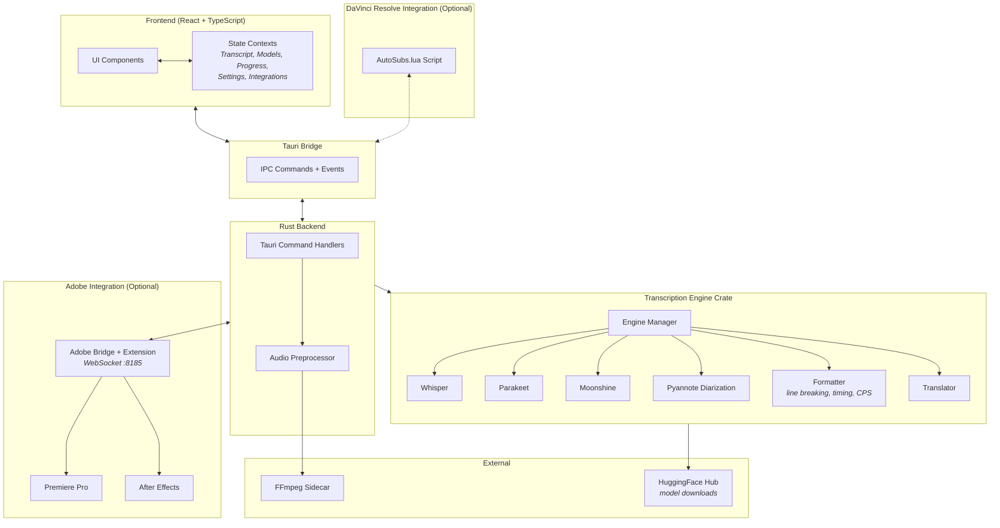

# AutoSubs App

A cross-platform desktop app for generating subtitles with speaker diarization, translation, DaVinci Resolve integration, and Adobe Premiere Pro / After Effects integration via the bundled CEP extension — powered by AI transcription models running locally on your machine.

## Documentation

- **[CLI Guide](../Docs/cli.md)** - Command-line interface reference
- **[Contributing Guide](../CONTRIBUTING.md)** - Development setup and contribution workflow
- **[AGENTS.md](../AGENTS.md)** - AI agent context with architecture gotchas and bridge details
- **[Resolve Integration](../Docs/resolve_integration.md)** - DaVinci Resolve integration architecture and development
- **[Adobe Extension](../Adobe-Extension/README.md)** - Adobe Premiere Pro/After Effects integration details

## Tech Stack

- **Frontend:** React + TypeScript (Vite)
- **Desktop Framework:** Tauri 2
- **Backend:** Rust (async via Tokio)
- **Transcription:** Whisper, Parakeet, Moonshine (via whisper-rs / ONNX Runtime)
- **Speaker Diarization:** Pyannote
- **Translation:** Google Translate API
- **Audio Processing:** FFmpeg (bundled sidecar)

## Architecture Overview

**How a transcription works end-to-end:**
1. User selects a file and clicks Transcribe
2. Rust backend preprocesses audio via FFmpeg (normalization, format conversion)
3. Transcription engine runs the chosen AI model (Whisper / Parakeet / Moonshine) locally
4. Optionally runs Pyannote for speaker diarization and Google Translate for translation
5. Formatter applies line-breaking, timing constraints, and language-specific rules
6. Results stream back to the UI in real time; user edits and exports

---

## Key Directories

| Directory | Purpose |
|---|---|
| `src/` | React frontend — components, contexts, hooks, utilities |
| `src/components/` | UI organized by feature (transcription, subtitles, settings, processing) |
| `src/contexts/` | Global state management (transcript, progress, models, settings, editor integrations) |
| `src-tauri/src/` | Rust backend — Tauri commands, audio preprocessing, logging |
| `src-tauri/crates/transcription-engine/` | Core engine — transcription, diarization, formatting, translation |
| `src-tauri/crates/transcription-engine/src/engines/` | Model-specific implementations (Whisper, Parakeet, Moonshine) |
| `src-tauri/resources/` | DaVinci Resolve Lua script, Adobe CEP extension resources, and subtitle templates |

## Model Cache Location

AI transcription models are downloaded to the app's cache directory. The location varies by platform:

- **macOS**: `~/Library/Caches/com.autosubs/models`
- **Linux**: `~/.cache/com.autosubs/models` (or `$XDG_CACHE_HOME/com.autosubs/models` if set)
- **Windows**: `%LOCALAPPDATA%\com.autosubs\models` (typically `C:\Users\{username}\AppData\Local\com.autosubs\models`)

The cache directory is automatically created on first model download. Models can be managed through the app's model selection UI.

## Development

For development setup, build commands, and platform-specific prerequisites, see the **[Contributing Guide](../CONTRIBUTING.md)**.

## Detailed Documentation

For in-depth architecture docs, component breakdowns, and to ask questions about the codebase, visit **[AutoSubs on DeepWiki](https://deepwiki.com/tmoroney/auto-subs)** — it provides detailed documentation with agentic search and Q&A.
