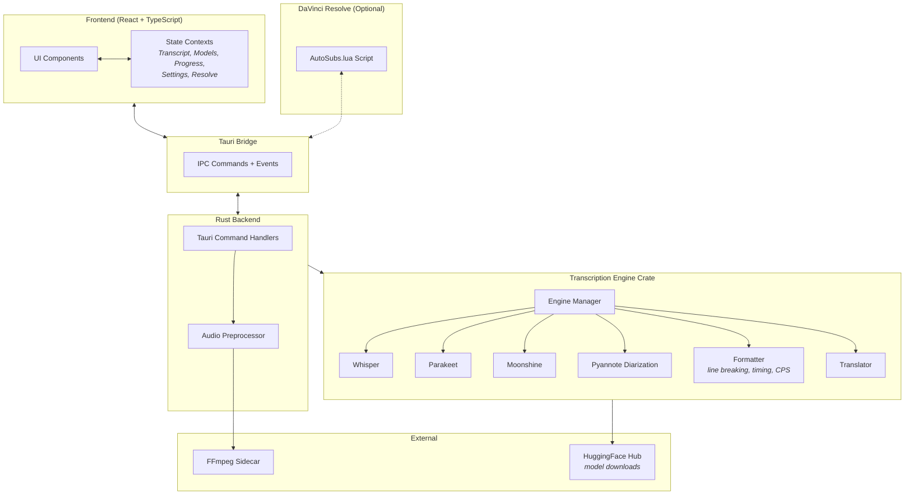

# AutoSubs App

A cross-platform desktop app for generating subtitles with speaker diarization, translation, and DaVinci Resolve integration — powered by AI transcription models running locally on your machine.

## Tech Stack

- **Frontend:** React + TypeScript (Vite)
- **Desktop Framework:** Tauri 2
- **Backend:** Rust (async via Tokio)
- **Transcription:** Whisper, Parakeet, Moonshine (via whisper-rs / ONNX Runtime)
- **Speaker Diarization:** Pyannote
- **Translation:** Google Translate API
- **Audio Processing:** FFmpeg (bundled sidecar)

## Architecture Overview



## Key Directories

| Directory | Purpose |
|---|---|
| `src/` | React frontend — components, contexts, hooks, utilities |
| `src/components/` | UI organized by feature (transcription, subtitles, settings, processing) |
| `src/contexts/` | Global state management (transcript, progress, models, settings, Resolve) |
| `src-tauri/src/` | Rust backend — Tauri commands, audio preprocessing, logging |
| `src-tauri/crates/transcription-engine/` | Core engine — transcription, diarization, formatting, translation |
| `src-tauri/crates/transcription-engine/src/engines/` | Model-specific implementations (Whisper, Parakeet, Moonshine) |
| `src-tauri/resources/` | DaVinci Resolve Lua script + subtitle templates |

## Model Cache Location

AI transcription models are downloaded to the app's cache directory. The location varies by platform:

- **macOS**: `~/Library/Caches/com.autosubs/models`
- **Linux**: `~/.cache/com.autosubs/models` (or `$XDG_CACHE_HOME/com.autosubs/models` if set)
- **Windows**: `%LOCALAPPDATA%\com.autosubs\models` (typically `C:\Users\{username}\AppData\Local\com.autosubs\models`)

The cache directory is automatically created on first model download. Models can be managed through the app's model selection UI.

## Getting Started

See the [root README](../README.md) for installation and usage instructions.

For development:

```bash
cd AutoSubs-App
npm install
npm run tauri dev
```

Requires Node.js and a Rust toolchain. See [tauri.app](https://tauri.app) for prerequisites.

## Detailed Documentation

For in-depth architecture docs, component breakdowns, and to ask questions about the codebase, visit **[AutoSubs on DeepWiki](https://deepwiki.com/tmoroney/auto-subs)** — it provides detailed documentation with agentic search and Q&A.
