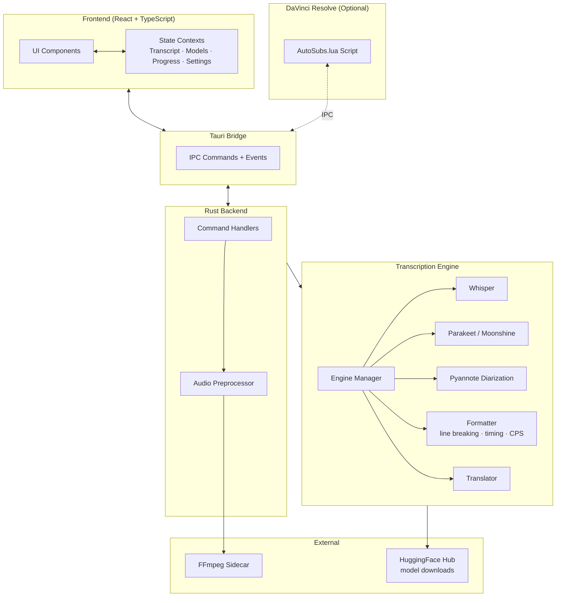

# AutoSubs – Subtitles Made Simple

Create high‑quality subtitles with **one click**. AutoSubs delivers **fast, accurate, and fully customisable** subtitles in a sleek, intuitive interface — works standalone or integrated with DaVinci Resolve.

[](https://tom-moroney.com/release-tracker/)
[](https://tom-moroney.com/release-tracker/)
[](https://deepwiki.com/tmoroney/auto-subs)

### 📥 One‑Click Installer: [Windows](https://github.com/tmoroney/auto-subs/releases/latest/download/AutoSubs-windows-x86_64.exe) ✨ [macOS (Apple Silicon)](https://github.com/tmoroney/auto-subs/releases/latest/download/AutoSubs-Mac-ARM.pkg) ✨ [macOS (Intel)](https://github.com/tmoroney/auto-subs/releases/latest/download/AutoSubs-Mac-Intel.pkg)

### 🐧 [Linux (.deb): see install commands below](#quick-start)

<a href="https://www.buymeacoffee.com/tmoroney" target="_blank"></a>

---

## What AutoSubs Does

AutoSubs runs **AI transcription models locally** on your machine — no cloud, no subscription. Drop in any audio or video file, and it produces accurate, timestamped subtitles with speaker labels.

**Core capabilities:**
- Fast, accurate transcription in many languages
- Speaker diarization with automatic labeling and colors
- Translation to English (more languages coming)
- Export to SRT, plain text, or directly into DaVinci Resolve
- Per-speaker subtitle styling (color, outline, border) when using Resolve

Generate Subtitles & Label Speakers |  Advanced Settings
:-------------------------:|:-------------------------:
 | 

---

## Architecture Overview

AutoSubs is a [Tauri](https://tauri.app) desktop app — a **React + TypeScript** frontend backed by a **Rust** engine, packaged as a native app for Windows, macOS, and Linux.



**How a transcription works end-to-end:**
1. User selects a file and clicks Transcribe
2. Rust backend preprocesses audio via FFmpeg (normalization, format conversion)
3. Transcription engine runs the chosen AI model (Whisper / Parakeet / Moonshine) locally
4. Optionally runs Pyannote for speaker diarization and Google Translate for translation
5. Formatter applies line-breaking, timing constraints, and language-specific rules
6. Results stream back to the UI in real time; user edits and exports

---

## Quick Start

### 1) Download & Install

**🪟 Windows + 🍎 macOS:**
Download the installer for your platform from the links above and follow the prompts.

**🐧 Linux (.deb):**
```bash
wget https://github.com/tmoroney/auto-subs/releases/latest/download/AutoSubs-linux-x86_64.deb
sudo apt install ./AutoSubs-linux-x86_64.deb
# If you see dependency errors, run:
sudo dpkg -i AutoSubs-linux-x86_64.deb && sudo apt -f install
```

### 2) Choose a Workflow

#### Standalone Mode
1. Launch AutoSubs and select an audio/video file.
2. Pick your model and language/translation options.
3. Click **Transcribe**. Edit speakers/subtitles as needed.
4. Export as SRT, text, or copy to clipboard.

#### DaVinci Resolve Mode
1. Open DaVinci Resolve → **Workspace → Scripts → AutoSubs**.
2. Select your timeline/audio source and settings.
3. Click **Transcribe**. Edit speakers/subtitles as needed.
4. Send styled subtitles back to Resolve.

> [!WARNING]
> AutoSubs will not work with the Mac App Store version of DaVinci Resolve. Re-install from the [official website](https://www.blackmagicdesign.com/products/davinciresolve/) if needed.

---

## What's New in V3
- **New, cleaner UI** — easier to use and more consistent
- **Faster + lighter** — ~3× lower idle memory on a new Rust backend
- **Smarter models** — more choices, easy delete, and clear status badges
- **Better timing** — accurate with variable frame rates and drop-frame
- **Standalone mode** — transcribe any file, no Resolve required
- **Powerful editors** — modern subtitle editor and advanced per-speaker styling

---

## Contributing

PRs are welcome! For a full breakdown of the codebase before diving in, see the **[AutoSubs DeepWiki](https://deepwiki.com/tmoroney/auto-subs)**.

### Dev Setup

1. Clone the repo.
2. Install prerequisites: Node.js + Rust toolchain — see [tauri.app](https://tauri.app).
3. Start the app in dev mode:
   ```bash
   cd AutoSubs-App
   npm install
   npm run tauri dev
   ```
4. For Resolve integration during development, copy `AutoSubs-App/src-tauri/resources/Testing-AutoSubs.lua` into your Resolve scripts folder:
   - **Windows:** `%appdata%/Blackmagic Design/DaVinci Resolve/Support/Fusion/Scripts/Utility`
   - **macOS:** `/Library/Application Support/Blackmagic Design/DaVinci Resolve/Fusion/Scripts/Utility`

   Then change the path in `Testing-AutoSubs.lua` to point to your local AutoSubs installation and open it from Resolve via **Workspace → Scripts → Testing-AutoSubs**.

Backend code lives under `AutoSubs-App/src-tauri/`.

---

## Deep Dive

For detailed architecture docs, component breakdowns, and agentic Q&A on any part of the codebase, visit **[AutoSubs on DeepWiki](https://deepwiki.com/tmoroney/auto-subs)**.
