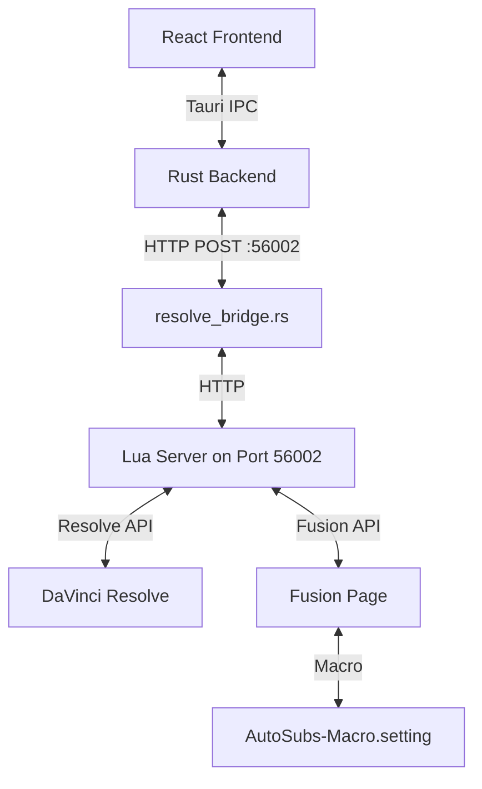

# AutoSubs DaVinci Resolve Integration

This document describes how AutoSubs integrates with DaVinci Resolve: architecture, communication protocol, Lua server, Fusion macro, and development workflow.

## Architecture



- **React Frontend**: UI for timeline selection, export settings, subtitle preview
- **Rust Backend (`resolve_bridge.rs`)**: HTTP client that posts requests to the Lua server
- **Lua Server (`autosubs_core.lua`)**: HTTP server running inside Resolve on port 56002
- **Fusion Macro (`AutoSubs-Macro.setting`)**: Fusion template for animated captions with per-word highlighting

### Why the HTTP Bridge?

The frontend originally used `@tauri-apps/plugin-http` to POST directly to the Lua server, but the plugin's response-body stream hangs indefinitely against Resolve's `Connection: close` responses. Routing through Rust's `reqwest` via the `resolve_bridge` Tauri command fixes this.

## Communication Flow

```text
React Frontend
  → invoke('resolve_bridge', { payload, timeoutSecs })
  → Rust resolve_bridge.rs
  → HTTP POST to http://127.0.0.1:56002/
  → Lua server (autosubs_core.lua)
  → Resolve/Fusion API
  → Response body → Frontend JSON.parse()
```

On failure the Lua server returns:
```json
{ "error": "Short user-facing message", "detail": "Raw error", "func": "Failed function name" }
```

The frontend `throwIfError` helper in `resolve-api.ts` checks for this and throws a `ResolveApiError`.

## Lua Server (`autosubs_core.lua`)

### Server Startup

- **Production** (`AutoSubs.lua`): Detects OS, locates the installed app, loads modules from the app's resources folder, launches the app, starts the HTTP server.
- **Development** (`AutoSubs (Dev).lua`): Generated by `npm run setup-resolve`. Points directly at your repo checkout, starts the server without launching the app window. Lua edits take effect on next script run.

### Exposed Functions

**Every function must be defined in two places:**

1. **`src/api/resolve-api.ts`** — TypeScript wrapper that calls `callResolve({ func: 'FunctionName', ...params })` and handles errors
2. **`modules/autosubs_core.lua`** — Lua handler that runs inside Resolve and does the actual work

Adding a function in only one place will silently do nothing (the call reaches the Lua server but finds no matching handler, or the frontend has no way to invoke it).

A typical pair looks like:

```ts
// resolve-api.ts
export async function jumpToTime(seconds: number) {
  return callResolve({ func: 'JumpToTime', seconds });
}
```

```lua
-- autosubs_core.lua
handlers["JumpToTime"] = function(data)
  local timeline = getCurrentTimeline()
  timeline:SetCurrentTimecode(secondsToTimecode(data.seconds))
  return { ok = true }
end
```

| Function | Description |
|---|---|
| `ExportAudio` | Exports timeline audio. Non-blocking — poll with `GetExportProgress`. |
| `GetExportProgress` | Returns export progress `{ active, progress, status }`. |
| `CancelExport` | Cancels the current audio export. |
| `GetTimelineInfo` | Returns current timeline metadata (frame rate, duration, tracks). |
| `GetTemplates` | Lists Fusion templates available in the media pool. |
| `CheckTrackConflicts` | Checks if subtitles would conflict with existing clips on a track. |
| `AddSubtitles` | Adds subtitle clips to the timeline using the Fusion macro. |
| `GeneratePreview` | Renders a single preview frame of a subtitle clip. |
| `StartPresetEdit` | Drops a test clip in Fusion for interactive preset editing. |
| `CapturePresetSettings` | Reads macro input values and cleans up the preset edit session. |
| `CancelPresetEdit` | Tears down the preset-edit clip/track without capturing. |
| `JumpToTime` | Moves the playhead to a given time in seconds. |

For parameters and return shapes, the Lua handlers in `autosubs_core.lua` are the authoritative reference.

## Fusion Macro (`AutoSubs-Macro.setting`)

The macro is a Fusion template stored as a `.setting` file. It renders animated captions with per-word highlighting using Text+, StyledTextFollower, KeyStretcherMod, BezierSpline, and XYPath tools.

Lua functions embedded in the macro's `CustomData` field handle preset get/set (`GetInputValues`, `SetInputValues`), animation logic (`SetAnimations`), and word-timing highlight updates (`UpdateHighlight`).

### Editing the Macro

Drag `AutoSubs-Macro.setting` into the Fusion page — it appears as a node and is ready to edit.

### Updating the Macro Bin for PRs

When making a PR that changes the macro, you must update the caption bin in the repository:

1. In Resolve, drag the Fusion Text with the updated macro loaded into your media pool
2. **Important:** Name the new clip exactly "AutoSubs Caption" — this name is hardcoded in `autosubs_core.lua`
3. Replace the current animated caption in the "AutoSubs" bin
4. Export the "AutoSubs" bin
5. Replace `AutoSubs-App/src-tauri/resources/AutoSubs/caption-bin.drb` with the exported bin file

This ensures that users who install the app will receive the updated macro with their caption bin.

## Development Workflow

### Setup

```bash
# In AutoSubs-App/
npm install
npm run setup-resolve   # generates AutoSubs (Dev).lua in Resolve's Scripts folder
npm run dev             # starts the app in dev mode
```

### Using the Dev Launcher

1. Open DaVinci Resolve
2. Go to **Workspace → Scripts → AutoSubs (Dev)**
3. The Lua server starts (no app window)
4. Edit files in `src-tauri/resources/modules/` and re-run the script to pick up changes
5. Re-run `npm run setup-resolve` if you move the repository

### Key Lua Files

| File | Purpose |
|---|---|
| `modules/autosubs_core.lua` | Main server and Resolve API functions |
| `modules/luaresolve.lua` | Helper functions for the Resolve API |
| `modules/font_fallback.lua` | Font fallback for non-Latin scripts |
| `modules/libavutil.lua` | Audio utilities |

### Debugging

- **Lua**: Use `print()` — output appears in Resolve's Console (**Script → Console**)
- **HTTP**: Check Rust backend logs for `resolve_bridge` requests
- **Fusion**: Inspect tool inputs in the Fusion inspector or check node connections in the Flow view

### Common Issues

| Symptom | Fix |
|---|---|
| Server not responding | Confirm Resolve is running and the dev script was launched; check port 56002 isn't in use |
| Macro not found | Verify `AutoSubs-Macro.setting` is in the correct location and re-import if needed |
| Animation not working | Check KeyStretcherMod connection, verify animation length > 0 and the animation is enabled |

## Platform-Specific Notes

### Windows

- Uses LuaJIT FFI (`MultiByteToWideChar`, `_wfopen`) for UTF-16 path handling — standard `io.open` fails on paths with special characters
- Installation path stored in `%APPDATA%\Blackmagic Design\DaVinci Resolve\Support\Fusion\Scripts\Utility\AutoSubs\install_path.txt`

### macOS

- App: `/Applications/AutoSubs.app`
- Resources: `/Applications/AutoSubs.app/Contents/Resources/resources`
- Scripts: `~/Library/Application Support/Blackmagic Design/DaVinci Resolve/Fusion/Scripts/Utility/`

### Linux

- App: `/usr/bin/autosubs`
- Resources: `/usr/lib/autosubs/resources`
- Scripts: `/opt/resolve/Fusion/Scripts/Utility/` or `$HOME/.local/share/DaVinciResolve/Fusion/Scripts/Utility/`

## API Reference

- `resolve_api_reference.txt` — Resolve scripting API
- `fusion_manual.md` — Fusion scripting and macro documentation

Blackmagic's documentation is limited and sometimes outdated. `autosubs_core.lua` is the most reliable reference for working Resolve API usage.
