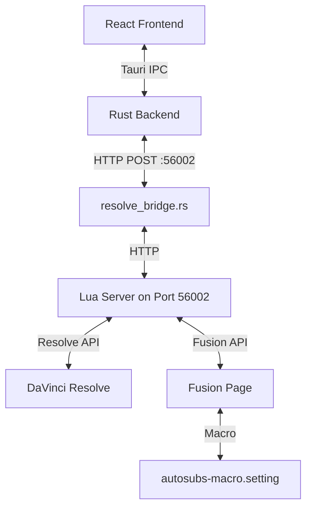

# AutoSubs DaVinci Resolve-Integration

This document describes how AutoSubs integrates with DaVinci Resolve: architecture, communication protocol, Lua server, Fusion macro, and development workflow.

## Quick Navigation

**What do you want to do?**

- **Set up development environment** → [Development Workflow](#development-workflow)
- **Change Resolve integration logic** → [Lua Server](#lua-server-autosubs_corelua)
- **Modify the animated caption** → [Fusion Macro](#fusion-macro-autosubs-macrosetting)
- **Understand the architecture** → [Architecture](#architecture)

## Architecture



- **React Frontend**: UI for timeline selection, export settings, subtitle preview
- **Rust Backend (`resolve_bridge.rs`)**: HTTP client that posts requests to the Lua server
- **Lua Server (`autosubs_core.lua`)**: HTTP server running inside Resolve on port 56002
- **Fusion Macro (`autoSubs-macro.setting`)**: Fusion template for animated captions with per-word highlighting

### Why the HTTP Bridge?

The frontend originally used `@tauri-apps/plugin-http` to POST directly to the Lua server, but the plugin's response-body stream hangs indefinitely against Resolve's `Connection: close` responses. Routing through Rust's `reqwest` via the `resolve_bridge` Tauri command fixes this.

## Communication Flow

```text
React Frontend
  → invoke('resolve_bridge', { payload, timeoutSecs })
  → Rust resolve_bridge.rs
  → HTTP POST to http://127.0.0.1:56002/
  → Lua server (autosubs_core.lua)
  → Resolve/Fusion API
  → Response body → Frontend JSON.parse()
```

On failure the Lua server returns:
```json
{ "error": "Short user-facing message", "detail": "Raw error", "func": "Failed function name" }
```

The frontend `throwIfError` helper in `resolve-api.ts` checks for this and throws a `ResolveApiError`.

## Development Workflow

### Setup

```bash
# In AutoSubs-App/
npm install
npm run setup-resolve   # generates AutoSubs (Dev).lua in Resolve's Scripts folder
npm run dev             # starts the app in dev mode
```

### Using the Dev Launcher

1. Open DaVinci Resolve
2. Go to **Workspace → Scripts → AutoSubs (Dev)**
3. The Lua server starts (no app window)
4. Edit files in `src-tauri/resources/modules/` and re-run the script to pick up changes
5. Re-run `npm run setup-resolve` if you move the repository

### Key Lua Files

| File | Purpose |
|---|---|
| `modules/autosubs_core.lua` | Main server and Resolve API functions |
| `modules/luaresolve.lua` | Helper functions for the Resolve API |
| `modules/font_fallback.lua` | Font fallback for non-Latin scripts |
| `modules/libavutil.lua` | Audio utilities |

### Debugging

- **Lua**: Use `print()` — output appears in Resolve's Console (**Script → Console**)
- **HTTP**: Check Rust backend logs for `resolve_bridge` requests
- **Fusion**: Inspect tool inputs in the Fusion inspector or check node connections in the Flow view

### Common Issues

| Symptom | Fix |
|---|---|
| Server not responding | Confirm Resolve is running and the dev script was launched; check port 56002 isn't in use |
| Macro not found | Verify `autosubs-macro.setting` is in the correct location and re-import if needed |
| Animation not working | Check KeyStretcherMod connection, verify animation length > 0 and the animation is enabled |

## Lua Server (`autosubs_core.lua`)

### Server Startup

Both scripts are thin **launchers** — they set up Lua module paths and delegate immediately to `autosubs_core.lua`. All real logic lives in `autosubs_core.lua`; there is almost never a reason to edit the launchers.

- **Production** (`AutoSubs.lua`): Sets `package.path`, verifies that `autosubs_core.lua` exists at the expected location, then calls `AutoSubs:Init()`. Launches the app window.
- **Development** (`AutoSubs (Dev).lua`): Same pattern, but points at your repo checkout and starts the server without launching the app window. Lua edits take effect on next script run.

### How the Launchers Are Generated

`AutoSubs.lua` is generated during installation — do not hand-edit it:

- **Windows**: The NSIS installer (`src-tauri/windows/hooks.nsi`) generates `AutoSubs.lua` at install time with the chosen installation path baked in as a Lua long-bracket string.
- **macOS / Linux**: The `AutoSubs.lua` checked in to the repo is used directly; paths are pre-defined (`/Applications/AutoSubs.app` on macOS, `/usr/bin/autosubs` on Linux).

`AutoSubs (Dev).lua` follows the same pattern: `npm run setup-resolve` reads the template from `src-tauri/resources/AutoSubs (Dev).lua` and writes a generated copy — with your repo's absolute path baked in — to Resolve's Scripts folder.

### Exposed Functions

**Every function must be defined in two places:**

1. **`src/api/resolve-api.ts`** — TypeScript wrapper that calls `callResolve({ func: 'FunctionName', ...params })` and handles errors
2. **`modules/autosubs_core.lua`** — Lua handler that runs inside Resolve and does the actual work

Adding a function in only one place will silently do nothing (the call reaches the Lua server but finds no matching handler, or the frontend has no way to invoke it).

A typical pair looks like:

```ts
// resolve-api.ts
export async function jumpToTime(seconds: number) {
  return callResolve({ func: 'JumpToTime', seconds });
}
```

```lua
-- autosubs_core.lua
handlers["JumpToTime"] = function(data)
  local timeline = getCurrentTimeline()
  timeline:SetCurrentTimecode(secondsToTimecode(data.seconds))
  return { ok = true }
end
```

| Function | Description |
|---|---|
| `ExportAudio` | Exports timeline audio. Non-blocking — poll with `GetExportProgress`. |
| `GetExportProgress` | Returns export progress `{ active, progress, status }`. |
| `CancelExport` | Cancels the current audio export. |
| `GetTimelineInfo` | Returns current timeline metadata (frame rate, duration, tracks). |
| `GetTemplates` | Lists Fusion templates available in the media pool. |
| `CheckTrackConflicts` | Checks if subtitles would conflict with existing clips on a track. |
| `AddSubtitles` | Adds subtitle clips to the timeline using the Fusion macro. |
| `GeneratePreview` | Renders a single preview frame of a subtitle clip. |
| `StartPresetEdit` | Drops a test clip in Fusion for interactive preset editing. |
| `CapturePresetSettings` | Reads macro input values and cleans up the preset edit session. |
| `CancelPresetEdit` | Tears down the preset-edit clip/track without capturing. |
| `JumpToTime` | Moves the playhead to a given time in seconds. |

For parameters and return shapes, the Lua handlers in `autosubs_core.lua` are the authoritative reference.

## Fusion Macro (`autosubs-macro.setting`)

The macro is a Fusion template stored as a `.setting` file. It renders animated captions with per-word highlighting using Text+, StyledTextFollower, KeyStretcherMod, BezierSpline, and XYPath tools.

Lua functions embedded in the macro's `CustomData` field handle preset get/set (`GetInputValues`, `SetInputValues`), animation logic (`SetAnimations`), and word-timing highlight updates (`UpdateHighlight`).

### Recommended Development Extension

For editing `.setting` files, the **[Fusion Setting Highlighter](https://github.com/tmoroney/fusion-setting-highlighter)** extension is highly recommended. It provides syntax highlighting for Fusion `.setting` files with full embedded Lua support inside script blocks.

**Installation:**

macOS / Linux:
```bash
curl -fsSL https://raw.githubusercontent.com/tmoroney/fusion-setting-highlighter/master/scripts/install.sh | sh
```

Windows (PowerShell):
```powershell
irm https://raw.githubusercontent.com/tmoroney/fusion-setting-highlighter/master/scripts/install.ps1 | iex
```

### Editing the Macro

You need a Fusion text clip on the timeline to open in the Fusion page. The easiest starting point is the "AutoSubs Caption" clip in the **AutoSubs** bin in your media pool:

1. If the bin isn't in your media pool, drag `AutoSubs-App/src-tauri/resources/AutoSubs/caption-bin.drb` into the media pool to import it.
2. Drag the **AutoSubs Caption** clip from the bin onto the timeline.
3. Double-click the clip to open it in the Fusion page.
4. Delete the existing macro node.
5. Drag `autosubs-macro.setting` into the Fusion page — it appears as a node and is ready to edit.

<details>
<summary><strong>Animation Architecture</strong></summary>

All animation logic lives in `CustomData` inside `autosubs-macro.setting` as Lua long-bracket strings (`[[ ... ]]`) that are executed at runtime via `loadstring`. There are three parts:

**`Animations` table** — named strings, one `ApplyX` and one `ResetX` per animation. Each function receives a single `ctx` table:

```lua
ctx = {
    follower      -- StyledTextFollower tool
    animStretcher -- AnimationKeyframeStretcher tool
    animSpline    -- BezierSpline connected to the stretcher
    animInEnd     -- frame where the in-animation ends (0–100 range)
    animOutStart  -- frame where the out-animation starts (0–100 range)
    mode          -- 0 = in only, 1 = out only, 2 = both
    level         -- 0 = line, 1 = word
}
```

**`AnimationRegistry`** — an ordered list of descriptors. `SetAnimations` loops over this; it never hardcodes individual animation names.

```lua
{ controlKey = "PopInEnabled", usesFade = true, applyKey = "ApplyPopIn", resetKey = "ResetPopIn" }
```

- `controlKey` — the `UserControl` checkbox that enables this animation
- `usesFade` — if `true`, fade is automatically applied as a base layer when this animation is enabled (even if `FadeEnabled` is off)
- `applyKey` / `resetKey` — keys into the `Animations` table

**`SetAnimations`** — the orchestrator. On each call it: resets all registered animations, checks which are enabled and whether fade is needed, applies fade once (or flat opacity), then applies each enabled animation. It does not need to change when new animations are added.

</details>

### Adding a New Animation

Every animation needs its own enable/disable toggle, so adding one always involves both the logic and the Fusion node graph:

1. Add `ApplyX` and `ResetX` strings to the `Animations` table in `CustomData`.
2. Add a descriptor entry to `AnimationRegistry`.
3. Add the control key to `InputKeys` in `CustomData` (so presets capture its value).
4. Add a `UserControl` checkbox entry in the `UserControls = ordered()` block (around line 986), following the same pattern as `SlideUpEnabled`:

```lua
BounceEnabled = {
    LINKS_Name = "Bounce",
    LINKID_DataType = "Number",
    INPID_InputControl = "CheckboxControl",
    INP_Integer = true,
    INP_Default = 0,
    INP_Passive = true,
    INP_External = false,
    CBC_TriState = false,
},
```

Steps 1–2 are pure text edits in `autosubs-macro.setting`. Steps 3–4 require opening the macro in the Fusion page.

### Maintainer Note: Updating the Caption Bin

> **For maintainers only** — do not include `caption-bin.drb` in your PR.

When the macro changes, the caption bin must be regenerated before release. This is handled by the maintainer, not contributors, since the binary is opaque in code review and the app must be codesigned before shipping.

To regenerate the bin:

1. In Resolve, drag the Fusion Text with the updated macro loaded into your media pool.
2. Name the clip exactly **"AutoSubs Caption"** — this name is hardcoded in `autosubs_core.lua`.
3. Replace the current clip in the **AutoSubs** bin, then export the bin.
4. Replace `AutoSubs-App/src-tauri/resources/AutoSubs/caption-bin.drb` with the exported file.

## Platform-Specific Notes

### Windows

- Uses LuaJIT FFI (`MultiByteToWideChar`, `_wfopen`) for UTF-16 path handling — standard `io.open` fails on paths with special characters
- App: `%LOCALAPPDATA%\AutoSubs\AutoSubs.exe`
- Resources: `%LOCALAPPDATA%\AutoSubs\resources`
- Scripts: `%APPDATA%\Blackmagic Design\DaVinci Resolve\Support\Fusion\Scripts\Utility\`

### macOS

- App: `/Applications/AutoSubs.app`
- Resources: `/Applications/AutoSubs.app/Contents/Resources/resources`
- Scripts: `~/Library/Application Support/Blackmagic Design/DaVinci Resolve/Fusion/Scripts/Utility/`

### Linux

- App: `/usr/bin/autosubs`
- Resources: `/usr/lib/autosubs/resources`
- Scripts: `/opt/resolve/Fusion/Scripts/Utility/` or `$HOME/.local/share/DaVinciResolve/Fusion/Scripts/Utility/`

## API Reference

- `resolve_api_reference.txt` — Resolve scripting API
- `fusion_manual.md` — Fusion scripting and macro documentation

Blackmagic's documentation is limited and sometimes outdated. `autosubs_core.lua` is the most reliable reference for working Resolve API usage.
