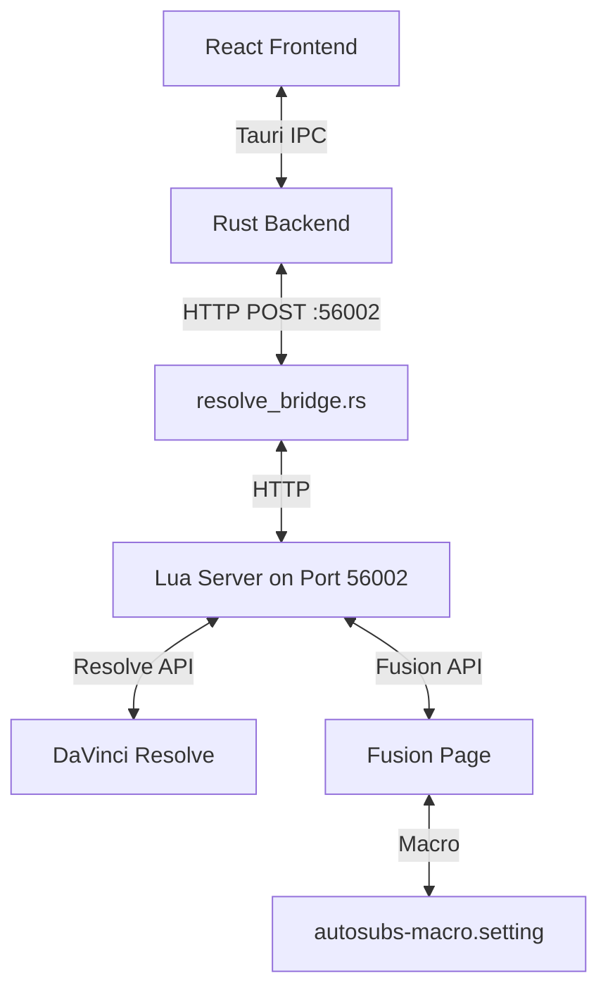

# AutoSubs DaVinci Resolve-Integration

This document describes how AutoSubs integrates with DaVinci Resolve: architecture, communication protocol, Lua server, Fusion macro, and development workflow.

## Quick Navigation

**What do you want to do?**

- **Set up development environment** → [Development Workflow](#development-workflow)
- **Change Resolve integration logic** → [Lua Server](#lua-server-autosubs_corelua)
- **Modify the animated caption** → [Caption styles](docs/caption-styles.md)
- **Understand the architecture** → [Architecture](#architecture)

## Architecture


```mermaid
flowchart TD
    ReactFE[React Frontend] <-->|Tauri IPC| RustBE[Rust Backend]
    RustBE <-->|HTTP POST :56002| resolve_bridge[resolve_bridge.rs]
    resolve_bridge <-->|HTTP| LuaServer[Lua Server on Port 56002]
    LuaServer <-->|Resolve API| Resolve[DaVinci Resolve]
    LuaServer <-->|Fusion API| Fusion[Fusion Page]
    Fusion <-->|Macro| Macro[autosubs-macro.setting]
```

- **React Frontend**: UI for timeline selection, export settings, subtitle preview
- **Rust Backend (`resolve_bridge.rs`)**: HTTP client that posts requests to the Lua server
- **Lua Server (`autosubs_core.lua`)**: HTTP server running inside Resolve on port 56002
- **Fusion Macro (`autoSubs-macro.setting`)**: Fusion template for animated captions with per-word highlighting

### Why the HTTP Bridge?

The frontend originally used `@tauri-apps/plugin-http` to POST directly to the Lua server, but the plugin's response-body stream hangs indefinitely against Resolve's `Connection: close` responses. Routing through Rust's `reqwest` via the `resolve_bridge` Tauri command fixes this.

## Communication Flow

```text
React Frontend
  → invoke('resolve_bridge', { payload, timeoutSecs })
  → Rust resolve_bridge.rs
  → HTTP POST to http://127.0.0.1:56002/
  → Lua server (autosubs_core.lua)
  → Resolve/Fusion API
  → Response body → Frontend JSON.parse()
```

On failure the Lua server returns:
```json
{ "error": "Short user-facing message", "detail": "Raw error", "func": "Failed function name" }
```

The frontend `throwIfError` helper in `resolve-api.ts` checks for this and throws a `ResolveApiError`.

## Development Workflow

### Setup

```bash
# In AutoSubs-App/
npm install
npm run setup-resolve   # generates AutoSubs (Dev).lua in Resolve's Scripts folder
npm run dev             # starts the app in dev mode
```

### Using the Dev Launcher

1. Open DaVinci Resolve
2. Go to **Workspace → Scripts → AutoSubs (Dev)**
3. The Lua server starts (no app window)
4. Edit files in `src-tauri/resources/modules/` and re-run the script to pick up changes
5. Re-run `npm run setup-resolve` if you move the repository

### Key Lua Files

| File | Purpose |
|---|---|
| `modules/autosubs_core.lua` | Main server and Resolve API functions |
| `modules/caption_style.lua` | Everything that differs between the two caption kinds |
| `modules/luaresolve.lua` | Helper functions for the Resolve API |
| `modules/font_fallback.lua` | Font fallback for non-Latin scripts |
| `modules/libavutil.lua` | Audio utilities |

### Debugging

- **Lua**: Use `print()` — output appears in Resolve's Console (**Script → Console**)
- **HTTP**: Check Rust backend logs for `resolve_bridge` requests
- **Fusion**: Inspect tool inputs in the Fusion inspector or check node connections in the Flow view

### Common Issues

| Symptom | Fix |
|---|---|
| Server not responding | Confirm Resolve is running and the dev script was launched; check port 56002 isn't in use |
| Macro not found | Verify `autosubs-macro.setting` is in the correct location and re-import if needed |
| Animation not working | Check KeyStretcherMod connection, verify animation length > 0 and the animation is enabled |

## Lua Server (`autosubs_core.lua`)

### Server Startup

Both scripts are thin **launchers** — they set up Lua module paths and delegate immediately to `autosubs_core.lua`. All real logic lives in `autosubs_core.lua`; there is almost never a reason to edit the launchers.

- **Production** (`AutoSubs.lua`): Sets `package.path`, verifies that `autosubs_core.lua` exists at the expected location, then calls `AutoSubs:Init()`. Launches the app window.
- **Development** (`AutoSubs (Dev).lua`): Same pattern, but points at your repo checkout and starts the server without launching the app window. Lua edits take effect on next script run.

### How the Launchers Are Generated

`AutoSubs.lua` is generated during installation — do not hand-edit it:

- **Windows**: The NSIS installer (`src-tauri/windows/hooks.nsi`) generates `AutoSubs.lua` at install time with the chosen installation path baked in as a Lua long-bracket string.
- **macOS / Linux**: The `AutoSubs.lua` checked in to the repo is used directly; paths are pre-defined (`/Applications/AutoSubs.app` on macOS, `/usr/bin/autosubs` on Linux).

`AutoSubs (Dev).lua` follows the same pattern: `npm run setup-resolve` reads the template from `src-tauri/resources/AutoSubs (Dev).lua` and writes a generated copy — with your repo's absolute path baked in — to Resolve's Scripts folder.

### Exposed Functions

**Every function must be defined in two places:**

1. **`src/api/resolve-api.ts`** — TypeScript wrapper that calls `callResolve({ func: 'FunctionName', ...params })` and handles errors
2. **`modules/autosubs_core.lua`** — Lua handler that runs inside Resolve and does the actual work

Adding a function in only one place will silently do nothing (the call reaches the Lua server but finds no matching handler, or the frontend has no way to invoke it).

A typical pair looks like:

```ts
// resolve-api.ts
export async function jumpToTime(seconds: number) {
  return callResolve({ func: 'JumpToTime', seconds });
}
```

```lua
-- autosubs_core.lua, in the `handlers` table
JumpToTime = function(req)
    JumpToTime(req.seconds)
    return { message = "Jumped to time" }
end,
```

Handlers take the decoded request table rather than positional arguments, so a
field renamed on the TypeScript side arrives as `nil` instead of silently
shifting every argument after it. The return value is encoded as the response
body; a handler that stops or reloads the server returns a control table
(`{ quit = true }`) as its second result.

| Function | Description |
|---|---|
| `ExportAudio` | Exports timeline audio. Non-blocking — poll with `GetExportProgress`. |
| `GetExportProgress` | Returns export progress `{ active, progress, status }`. |
| `CancelExport` | Cancels the current audio export. |
| `GetTimelineInfo` | Returns current timeline metadata (frame rate, duration, tracks). |
| `GetTemplates` | Lists Fusion templates available in the media pool. |
| `CheckTrackConflicts` | Checks if subtitles would conflict with existing clips on a track. |
| `AddSubtitles` | Adds subtitle clips to the timeline using the Fusion macro. |
| `GeneratePreview` | Renders a single preview frame of a subtitle clip. |
| `BatchApplyStyle` | Restyles caption clips already on the timeline. |
| `OpenPresetEdit` | Opens a caption in Fusion for editing and keeps it open. |
| `SavePresetEdit` | Reads the open caption's values, renders its thumbnail, closes. |
| `CancelPresetEdit` | Closes the edit session without reading anything. |
| `JumpToTime` | Moves the playhead to a given time in seconds. |

For parameters and return shapes, the Lua handlers in `autosubs_core.lua` are the authoritative reference.


## Caption styles and the Fusion macro

The two kinds of caption, the preset format, and how a style is edited are
documented separately:

- [`docs/caption-styles.md`](docs/caption-styles.md) - the two caption kinds, the preset format, the macro, and the editing round trip
- [`docs/animation-system.md`](docs/animation-system.md) - how the macro implements its animations
- [`docs/maintainer-template-release.md`](docs/maintainer-template-release.md) - regenerating `caption-bin.drb` for a release

## Platform-Specific Notes

### Windows

- Uses LuaJIT FFI (`MultiByteToWideChar`, `_wfopen`) for UTF-16 path handling — standard `io.open` fails on paths with special characters
- App: `%LOCALAPPDATA%\AutoSubs\AutoSubs.exe`
- Resources: `%LOCALAPPDATA%\AutoSubs\resources`
- Scripts: `%APPDATA%\Blackmagic Design\DaVinci Resolve\Support\Fusion\Scripts\Utility\`

### macOS

- App: `/Applications/AutoSubs.app`
- Resources: `/Applications/AutoSubs.app/Contents/Resources/resources`
- Scripts: `~/Library/Application Support/Blackmagic Design/DaVinci Resolve/Fusion/Scripts/Utility/`

### Linux

- App: `/usr/bin/autosubs`
- Resources: `/usr/lib/autosubs/resources`
- Scripts: `/opt/resolve/Fusion/Scripts/Utility/` or `$HOME/.local/share/DaVinciResolve/Fusion/Scripts/Utility/`

## API Reference

App-specific docs live here; all general Resolve/Fusion reference lives in the skill (single source of truth):

- `docs/caption-styles.md` — the two caption kinds, the preset format, and the editing round trip (app-specific)
- `docs/animation-system.md` — how the AutoSubs macro implements its animations (app-specific)
- `docs/maintainer-template-release.md` — regenerating `caption-bin.drb` (maintainers)
- `davinci-resolve-fusion/` — the general Resolve/Fusion skill (distributed separately; also the reference for this project):
    - `references/resolve-api.txt` — Resolve scripting API (re-sync with `davinci-resolve-fusion/scripts/update-resolve-api.sh`)
    - `references/fusion-manual/00-index.md` — Fusion manual, split one-file-per-class for easy searching
    - `references/animation.md`, `references/macro-authoring.md`, `references/fusion-templates.md` — general guides
    - `examples/` — runnable Resolve API examples

Blackmagic's documentation is limited and sometimes outdated. `autosubs_core.lua` is the most reliable reference for working Resolve API usage.

