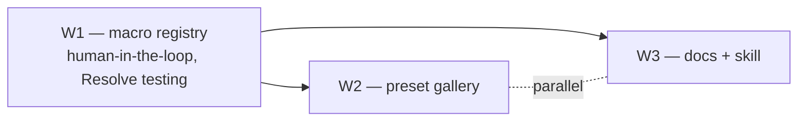

# AutoSubs — Macro extensibility, preset sharing & docs (handoff plans)

Three coordinated workstreams to make the Fusion macro easy to extend, let users share/browse caption presets, and turn the Fusion manual into navigable docs + a project-local skill. Each doc is a self-contained handoff spec (context, file lists, step-by-step, verification, risks).

| # | Plan | What it delivers |
|---|---|---|
| **W1** | [W1-macro-extensibility.md](./W1-macro-extensibility.md) | Externalize the macro's Lua into `.lua` source files; one-file-per-animation **registry** with a declarative `usesFade` flag; `build-macro` step; **runtime injection** so logic changes don't need a `.drb` re-export; `fuscript` test harness. |
| **W2** | [W2-preset-gallery.md](./W2-preset-gallery.md) | GitHub-repo-backed community preset gallery (no backend): browse + 1-click install in-app, "Submit preset" via pre-filled PR, preset compat metadata (macro version, fonts, tags). |
| **W3** | [W3-fusion-docs-skill.md](./W3-fusion-docs-skill.md) | **Lossless** restructure of the Fusion manual via a hybrid PDF pipeline (deterministic ground truth + model-assisted structure, with a completeness check), wrapped into a fresh project-local skill `.devin/skills/autosubs-fusion/` + an "add an animation" cookbook. |

## Sequencing

1. **Do W1 first.** Both W2 (preview render for "Submit preset") and W3 (animation cookbook) build on the registry. W1 is **human-in-the-loop** — verifying animations requires rendering frames in a live DaVinci Resolve session, which a subagent can't do.
2. **Then W2 and W3 in parallel** — mostly disjoint file sets. The only shared edits are append-only docs (`README.md`, `CONTRIBUTING.md`, `Resolve-Integration/README.md`), easy to reconcile.

## Using subagents

- **Good for subagents:** W3 doc restructuring (read/transform-heavy, no Resolve), W2 gallery UI scaffolding (self-contained once the data shape is fixed).
- **Avoid:** parallel subagents writing overlapping code, or any W1 macro work that needs interactive Resolve verification.

## Key decisions already made

- Preset sharing: **GitHub repo gallery, no backend.**
- Macro refactor: **externalize Lua + build step** (registry + declarative fade), runtime injection to avoid `.drb` re-exports for logic changes.
- Manual: **lossless hybrid** pipeline from the **original PDF** (user provides it; not in the repo). Model assists structure/tables/figures only; deterministic extraction is the verifiable ground truth.
- **Dropped:** the Text+ → macro-code extraction script (maintenance burden; existing preset-edit capture covers the bounded case).
- The existing global `davinci-resolve` / `fusion-animation` skills are **discarded** as sources; W3 builds fresh.
