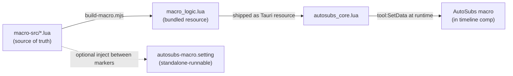

# W1 — Make the Fusion macro easy to extend

> **Goal:** Lower the barrier to adding **animations** and **style controls** to the AutoSubs caption macro so that Fusion-savvy contributors (or AI agents) can extend it without reverse-engineering a 2,000-line `.setting` file or re-exporting a binary bin on every logic change.
>
> **Status:** Spec / handoff. No code written yet.
>
> **Sequencing:** Do this workstream **first** — W2's "submit preset" preview render and W3's animation cookbook both build on the registry introduced here. This work is **human-in-the-loop**: verifying that animations actually look right requires rendering frames in a live DaVinci Resolve session, which a subagent cannot do.

---

## 1. Current state (why it's painful)

The macro lives in [`Resolve-Integration/autosubs-macro.setting`](../Resolve-Integration/autosubs-macro.setting). It is a Fusion `.setting` file — a Lua-like table — with two sections:

| Section | Lines (approx) | What it is | Who edits it |
|---|---|---|---|
| `CustomData` | 6–844 | Embedded Lua logic: input get/set, animation builders, highlight logic, word timing | **The painful part** |
| `Tools` | 846–1996 | The Fusion node graph (Text+, StyledTextFollower, KeyStretcher, BezierSpline, XYPath) + `UserControls` + `InstanceInput` buttons | Must be edited inside Fusion |

### How logic is stored and run today

All logic is stored as **Lua long-bracket strings** (`[[ ... ]]`) inside `CustomData` and executed at runtime via `loadstring(tool:GetData("Name"))()`. Examples:

- `GetInputValues` / `SetInputValues` (lines 62–82) — round-trip the macro's inputs to/from a preset dict.
- `Animations` table (lines 83–257) — per-animation builders: `RemoveOffsetModifiers`, `ApplyFade`/`ResetFade`, `ApplyPopIn`/`ResetPopIn`, `ApplySlideUp`.
- `SetAnimations` (lines 259–324) — orchestrator that decides which animations to apply.
- `UpdateHighlight` (line 786+) — per-word highlight styling.
- `InputKeys` (lines 29–61) — the list of 32 input names presets capture.

### The four points of friction

1. **Editing Lua inside a `.setting` string** — no syntax highlighting (without the custom extension), no linting, no unit testing, painful diffs.
2. **Adding an animation touches 4+ places**: write a builder in the `Animations` table, add a `UserControl` toggle in the node graph, add the key to `InputKeys`, and wire an `if <x>Enabled` branch into `SetAnimations`.
3. **Every logic change requires re-exporting the binary** `caption-bin.drb` (see [Resolve-Integration/README.md](../Resolve-Integration/README.md) "Updating the Macro Bin for PRs"), because the logic is baked into the macro instance inside the bin.
4. **Implicit fade coupling** — `SetAnimations` applies fade whenever *any* animation is enabled (lines 287–299), because pop-in/slide-up "look nicer" with a fade. This is invisible magic three functions away from the animation that depends on it.

### The orchestrator's implicit fade logic (the thing to fix)

From `SetAnimations` (lines 287–311):

```lua
-- Apply fade animation
if fadeEnabled or slideUpEnabled or popInEnabled then
    local applyFade = loadstring(anims.ApplyFade)()
    applyFade(follower, animStretcher, animSpline, animInEnd, animOutStart, animationMode)
else
    -- flat opacity = 1
    ...
end

if popInEnabled then ... applyPopIn(...) end
if slideUpEnabled then ... applySlideUp(...) end
```

Fade is hard-coded as a base layer for pop-in and slide-up. We make this **declarative** (see §3.3).

---

## 2. Target architecture

**Principle:** Split *logic* from *graph*.

- **Node graph + `UserControls` stay in the `.setting`/`.drb`** — these genuinely must be authored in Fusion.
- **All `CustomData` logic moves to real `.lua` source files** under `Resolve-Integration/macro-src/`, becomes the source of truth, and is **injected into the macro at runtime** via `tool:SetData(...)` by the Lua server.

Result:
- Adding/changing an **animation** = add one `.lua` file. **No `.drb` re-export.**
- Adding a brand-new **control** (e.g. a new color or slider) = still requires a Fusion round-trip + `.drb` re-export, but with a short documented checklist.



### Why runtime injection works

`SetInputValues` already calls `loadstring(tool:GetData("SetAnimations"))()(comp, tool)` (line 79). So whatever string is stored under the `SetAnimations` key is what runs. If `autosubs_core.lua` calls `tool:SetData("SetAnimations", <file contents>)` **before** invoking `SetInputValues`, the freshly shipped logic runs — regardless of what is baked into the `.drb`. The `.drb`'s embedded logic becomes a **fallback/bootstrap** that only needs occasional re-sync.

---

## 3. Implementation steps

### 3.1 Create the source tree

```
Resolve-Integration/macro-src/
  README.md                     # how this folder maps to the macro; how to add things
  logic/
    get_input_values.lua        # port of GetInputValues (lines 62–71)
    set_input_values.lua        # port of SetInputValues (lines 72–82)
    set_animations.lua          # registry-driven orchestrator (replaces lines 259–324)
    update_highlight.lua         # port of UpdateHighlight (line 786+)
    helpers.lua                 # RemoveOffsetModifiers, ConvertToDelayKeyframes, round(), etc.
  animations/
    _registry.lua               # discovers + orders animation modules; exposes list
    fade.lua                    # descriptor (see §3.3)
    pop_in.lua
    slide_up.lua
  fade_helper.lua               # the single shared fade implementation
```

> Note on file extension: these are authored as `.lua` for tooling/linting, but they are **fragments** that get bundled. Keep each one as `return function(...) ... end` or `return { ... }` so they can be `loadstring`'d individually, mirroring the current pattern.

### 3.2 Animation descriptor contract

Each `animations/*.lua` returns a **descriptor table** instead of a bare function:

```lua
-- animations/slide_up.lua
return {
  id         = "slideUp",          -- stable identifier
  label      = "Slide Up",          -- human label (for docs/UI)
  controlKey = "SlideUpEnabled",   -- the UserControl that toggles it (1/0)
  usesFade   = true,                -- declarative: include a companion fade-in (see §3.3)
  -- apply receives a context table so new animations don't need new positional args
  apply = function(ctx)
    -- ctx = { comp, tool, follower, animInEnd, animOutStart, animationLevel, mode, fps }
    -- ... port of ApplySlideUp (lines 211–257) ...
  end,
  reset = function(follower)
    -- ... port of the reset logic (RemoveOffsetModifiers + restore offsets) ...
  end,
}
```

- `pop_in.lua` → `id="popIn"`, `controlKey="PopInEnabled"`, `usesFade=true`, port of `ApplyPopIn`/`ResetPopIn` (lines 152–209).
- `fade.lua` → `id="fade"`, `controlKey="FadeEnabled"`, `usesFade=false` (it *is* the fade), `apply` delegates to `fade_helper.lua`.
- `slide_up.lua` → as above, port of `ApplySlideUp` (lines 211–257) + offset reset.

`animations/_registry.lua` returns an ordered list of these descriptors. Order matters because fade must be applied before size/offset modifiers (preserve current ordering: fade → popIn → slideUp).

### 3.3 Make the fade coupling declarative (the §1.4 fix)

Keep **one** shared fade implementation in `fade_helper.lua` (the body of current `ApplyFade`, lines 103–138). Do **not** duplicate it into pop-in/slide-up.

`set_animations.lua` computes whether fade is needed by OR-ing the user toggle with any enabled animation's `usesFade`, then applies fade exactly once:

```lua
-- logic/set_animations.lua (pseudocode)
return function(comp, tool)
  local registry = loadstring(tool:GetData("AnimationRegistry"))()
  local follower = comp:FindTool("Follower1")
  local ctx = build_context(comp, tool, follower)   -- fps, animInEnd, animOutStart, mode, level

  -- 1. Reset everything (each module's reset + shared offset cleanup)
  for _, anim in ipairs(registry) do anim.reset(follower) end
  loadstring(helpers.RemoveOffsetModifiers)()(follower)

  -- 2. Determine enabled animations
  local enabled, needsFade = {}, (tool:GetInput("FadeEnabled") == 1)
  for _, anim in ipairs(registry) do
    if tool:GetInput(anim.controlKey) == 1 then
      table.insert(enabled, anim)
      if anim.usesFade then needsFade = true end
    end
  end

  -- 3. Apply the single shared fade (or flat opacity) once
  if needsFade then
    fade_helper.apply(follower, ctx)         -- sets Opacity1..4 + the fade spline
  else
    fade_helper.flat(follower, ctx)          -- flat opacity = 1 (current else-branch)
  end

  -- 4. Apply each enabled animation's own effect (skip the bare fade module's no-op)
  for _, anim in ipairs(enabled) do
    if anim.id ~= "fade" then anim.apply(ctx) end
  end

  -- 5. Stretcher time ranges + order spline (lines 313–322, unchanged)
  ...
end
```

**Why this is better than duplicating fade:** single source of truth for the fade curve (still DRY), the dependency is now visible right in `slide_up.lua` as `usesFade = true`, and a new animation author sets one boolean instead of editing the orchestrator. Applying fade is idempotent on `Opacity1..4`, so even if the model is wrong about an edge case, re-applying is safe.

### 3.4 Build/assembly script

Add `Resolve-Integration/scripts/build-macro.mjs` (Node ESM, matching the style of `AutoSubs-App/scripts/*.js`). Wire as a script — either in the existing `AutoSubs-App/package.json` (`"build:macro": "node \"../Resolve-Integration/scripts/build-macro.mjs\""`) or a small `package.json` in `Resolve-Integration/`.

The script:
1. Reads every file under `macro-src/`.
2. Produces **`AutoSubs-App/src-tauri/resources/macro_logic.lua`** — a single bundle that, when `loadstring`'d, returns a table of named logic blocks + the animation registry. This is the artifact `autosubs_core.lua` ships and injects.
3. (Optional but recommended) Injects the same blocks back into `autosubs-macro.setting` between sentinel markers, e.g.:
   ```lua
   -- @macro-src:begin set_animations
   SetAnimations = [[ ... generated ... ]],
   -- @macro-src:end set_animations
   ```
   This keeps the standalone `.setting` runnable for in-Fusion editing while `macro-src/` remains the source of truth. The script should be **idempotent** (running it twice produces no diff).
4. Validates: every `controlKey` referenced by an animation exists in `InputKeys`; every animation `id` is unique; the bundle parses as Lua (`luajit -bl` or a lightweight parse check).

> **Important:** the build step does **not** touch the binary `caption-bin.drb`. Logic reaches the user via runtime injection (§3.5). The `.drb` only changes when the node graph / `UserControls` change.

### 3.5 Runtime injection in `autosubs_core.lua`

File: [`AutoSubs-App/src-tauri/resources/modules/autosubs_core.lua`](../AutoSubs-App/src-tauri/resources/modules/autosubs_core.lua).

1. Load `macro_logic.lua` from the resources path once at startup (next to `caption-bin.drb`; see `assets_path` usage around lines 284–293).
2. Add a helper `inject_macro_logic(tool)` that calls `tool:SetData("SetAnimations", blocks.set_animations)`, `tool:SetData("SetInputValues", ...)`, `tool:SetData("AnimationRegistry", ...)`, `UpdateHighlight`, `GetInputValues`, helpers, etc.
3. Call `inject_macro_logic(tool)` in **both** code paths that touch the macro before applying settings:
   - `StartPresetEdit` (lines ~1488–1554) — right after `comp:FindTool("AutoSubs")`, **before** the `SetInputValues` seed call. This ensures the in-Fusion buttons the user clicks during editing also use the fresh logic.
   - `AddSubtitles` (preset-apply block, lines ~1167–1178) — before `loadstring(setter)()(comp, autosubsTool, presetSettings)`.
4. Keep the existing `pcall` guards so a malformed bundle degrades to the baked-in `.drb` logic rather than crashing.

**Caveat to document:** the macro's own `InstanceInput` buttons (graph lines ~1038, ~1081) call `SetAnimations`/`UpdateHighlight` from `GetData`. Injection on `StartPresetEdit` covers the edit session. Outside an AutoSubs session (a user poking the macro manually), the `.drb`'s baked logic runs — so the bundled logic and the `.drb` should be re-synced when a release is cut. Add this to the PR checklist.

### 3.6 Contributor test harness

Add `Resolve-Integration/scripts/test-macro.lua`, runnable via `fuscript` (see the `davinci-resolve` skill's run scripts, or directly:
`"/Applications/DaVinci Resolve/DaVinci Resolve.app/Contents/Libraries/Fusion/fuscript" test-macro.lua`).

It should:
1. Open/append the AutoSubs Caption template on a scratch timeline (reuse `StartPresetEdit` plumbing or a minimal copy).
2. `inject_macro_logic(tool)`.
3. Apply a sample settings dict that enables the animation under test.
4. Render a preview frame (reuse `GeneratePreview`) to a temp PNG and print the path.

This lets a contributor iterate on `macro-src/animations/*.lua` → rebuild → run harness → eyeball the frame, **without launching the full Tauri app**.

---

## 4. "Add a new animation" — the contributor flow (target)

This is the experience we are designing for (and what the W3 cookbook will document):

1. `cp macro-src/animations/pop_in.lua macro-src/animations/bounce.lua`.
2. Edit `bounce.lua`: set `id`, `label`, `controlKey = "BounceEnabled"`, `usesFade`, and the `apply`/`reset` keyframe logic.
3. If the animation needs a new toggle, add a `BounceEnabled` `UserControl` + `InputKeys` entry in Fusion and re-export `caption-bin.drb` (the *only* step needing Resolve authoring). If it reuses existing controls, **skip this entirely.**
4. `npm run build:macro`.
5. `fuscript test-macro.lua` → check the frame.
6. PR.

No edits to the orchestrator. No hunting through a 2,000-line file.

---

## 5. Files to create / modify

**Create**
- `Resolve-Integration/macro-src/**` (logic + animations + README, per §3.1)
- `Resolve-Integration/scripts/build-macro.mjs`
- `Resolve-Integration/scripts/test-macro.lua`
- `AutoSubs-App/src-tauri/resources/macro_logic.lua` (generated; gitignore or commit — decide, see §7)

**Modify**
- `Resolve-Integration/autosubs-macro.setting` — add sentinel markers; logic blocks become generated
- `AutoSubs-App/src-tauri/resources/modules/autosubs_core.lua` — load + inject `macro_logic.lua` in `StartPresetEdit` and `AddSubtitles`
- `AutoSubs-App/package.json` — add `build:macro` (and ideally run it in `build:tauri-prep`)
- `AutoSubs-App/src-tauri/tauri.conf.json` — ensure `macro_logic.lua` is bundled as a resource (verify the resources glob)
- `Resolve-Integration/README.md` — update "Editing the Macro" + PR checklist to reference `macro-src/` and the re-sync rule

---

## 6. Verification

- [ ] `npm run build:macro` is **idempotent** (run twice → no git diff).
- [ ] Generated `macro_logic.lua` parses (LuaJIT byte-compile check in the build script).
- [ ] `test-macro.lua` renders correct frames for **each** of fade / pop-in / slide-up, and for combinations (pop-in + fade off vs on) — confirm the `usesFade` path matches today's behavior.
- [ ] **Regression in Resolve:** create a preset, apply each built-in preset from [`built-in-presets.ts`](../AutoSubs-App/src/presets/built-in-presets.ts), confirm animations look identical to current `main`.
- [ ] Disable injection (simulate a bad bundle) → confirm `.drb` fallback still works (no crash).
- [ ] `StartPresetEdit` → click the in-Fusion animation buttons → they use injected logic.
- [ ] Full app smoke test: generate subtitles with a preset that has pop-in enabled.

---

## 7. Risks & open decisions

- **Injected logic vs baked `.drb` drift** — biggest risk. Mitigation: build script can also emit the blocks into the `.setting`, and the PR checklist requires re-exporting the `.drb` from the updated `.setting` at release time. Consider a CI check that diffs the `.drb`'s embedded logic against `macro_logic.lua`.
- **`tool:SetData` persistence** — confirm that data set on a timeline-clip's macro instance survives the `SetInputValues` call within the same session (it should; it's read immediately after). Validate early in a Resolve spike.
- **Commit vs generate `macro_logic.lua`** — recommend committing it (so the app builds without running the macro build) *and* having CI verify it's up to date.
- **New controls still need Resolve** — unavoidable; documented, not solved. Acceptable because the common contribution (a new animation reusing Opacity/Size/Offset) needs no graph change.
- **`fuscript` availability differs per OS** — harness should print a clear message if Resolve isn't found; document the Windows path.

---

## 8. Suggested commit sequence

1. Scaffold `macro-src/` + port existing logic verbatim (no behavior change) + `build-macro.mjs`; verify generated `.setting` is byte-identical in behavior.
2. Add runtime injection in `autosubs_core.lua` (still no behavior change); regression test.
3. Refactor animations into the registry + `usesFade` (behavior-preserving); regression test each animation.
4. Add `test-macro.lua` harness.
5. Docs updates (hand off remaining doc work to W3's cookbook).
