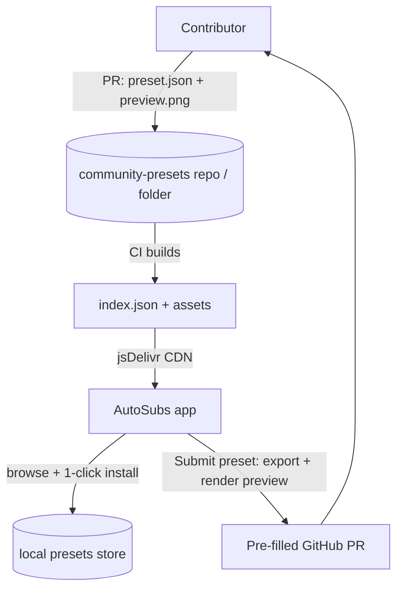

# W2 — Community preset sharing & in-app gallery

> **Goal:** Let users share the caption presets they build with the AutoSubs macro, and browse + install other people's presets directly inside the app — with **no backend to run or pay for**.
>
> **Status:** Spec / handoff. No code written yet.
>
> **Approach (decided):** GitHub-repo-backed gallery. Presets are JSON files + preview images in a public repo; an `index.json` is generated and served via CDN; the app fetches it, shows a browsable gallery, and installs with one click. Contributions happen via pull request (moderation = PR review).

---

## 1. Current state

Presets are modeled by `CaptionPreset` in [`AutoSubs-App/src/types.ts`](../AutoSubs-App/src/types.ts) (lines 148–157):

```ts
export interface CaptionPreset {
  id: string;            // "builtin:<slug>" for shipped, uuid for user presets
  name: string;
  description?: string;
  builtIn: boolean;
  version: number;       // schema version (starts at 1)
  createdAt: string;
  updatedAt: string;
  macroSettings: Record<string, unknown>;  // opaque dict round-tripped through the macro
}
```

State management is in [`AutoSubs-App/src/contexts/PresetsContext.tsx`](../AutoSubs-App/src/contexts/PresetsContext.tsx):
- Built-ins from [`built-in-presets.ts`](../AutoSubs-App/src/presets/built-in-presets.ts), user presets persisted to a Tauri store (`autosubs-presets.json`).
- **Already has `importPreset(json)` and `exportPreset(id)`** — `importPreset` validates the wrapper shape and generates a fresh id (lines 36–64, 154–158). This is exactly the install primitive the gallery needs.

The UI lives in [`AutoSubs-App/src/components/dialogs/caption-style/animated-preset-picker.tsx`](../AutoSubs-App/src/components/dialogs/caption-style/animated-preset-picker.tsx):
- `AnimatedPresetActions` — the Import (paste / from file) + "New Preset" buttons.
- `AnimatedPresetPicker` — the scrollable list of `PresetCard`s with per-preset overflow actions (export, copy JSON, edit, duplicate, delete).
- Consumed by [`add-to-timeline-dialog.tsx`](../AutoSubs-App/src/components/dialogs/add-to-timeline-dialog.tsx).

**Gaps:** no remote browsing, no thumbnails/previews in the picker, no way to publish a preset, and no compatibility metadata (macro version, fonts).

**Networking note:** Per [`AGENTS.md`](../AGENTS.md), the Tauri webview HTTP plugin has quirks against Resolve specifically — but that's only for the loopback bridge. Fetching a static `index.json` from a CDN is a normal cross-origin GET; use `@tauri-apps/plugin-http` (already a dependency) or `fetch`. Confirm CSP/allowlist in `tauri.conf.json` permits the CDN host.

---

## 2. Architecture (no backend)



### Where do the presets live?

Two options — recommend **(A)** for simplicity, switchable later:

- **(A) Folder in the existing repo:** `community-presets/` at repo root. Lowest friction, single PR target, presets versioned with the app.
- **(B) Dedicated repo** (e.g. `auto-subs-presets`): cleaner separation, independent contribution cadence, doesn't bloat the app repo history with images.

Either way the layout is the same:

```
community-presets/
  presets/
    <slug>/
      preset.json     # the CaptionPreset payload (see §3)
      preview.png     # rendered thumbnail (see §5)
      meta.json       # author, tags, dates, minMacroVersion (see §3)
  index.json          # GENERATED — flat list the app fetches
  scripts/
    build-index.mjs   # scans presets/, validates, emits index.json
```

### Serving

Use **jsDelivr** for CDN caching and to avoid `raw.githubusercontent.com` rate limits:
`https://cdn.jsdelivr.net/gh/<owner>/<repo>@<ref>/community-presets/index.json`

Pin to a tag/branch for stability; `@latest` or a `main` ref for "live." Preview images load via the same CDN base.

---

## 3. Data shapes

### `preset.json` (extends the exported preset)

The existing `exportPreset` strips `id`/timestamps/`builtIn` and emits `{ name, description, version, macroSettings }`. Add publishing/compat fields:

```jsonc
{
  "name": "Neon Pop",
  "description": "Bright pop-in with cyan highlight.",
  "version": 1,                    // preset schema version (existing)
  "minMacroVersion": 1,            // NEW: lowest macro version this preset targets
  "macroSettings": { /* ... */ }
}
```

### `meta.json` (gallery metadata, kept out of the installed preset)

```jsonc
{
  "slug": "neon-pop",
  "author": "github-handle",
  "tags": ["pop-in", "neon", "gaming"],
  "createdAt": "2026-06-13T00:00:00.000Z",
  "previewFonts": ["Futura"]       // fonts the preview used (for the missing-font notice)
}
```

### `index.json` (generated, fetched by app)

```jsonc
{
  "schema": 1,
  "generatedAt": "…",
  "presets": [
    {
      "slug": "neon-pop",
      "name": "Neon Pop",
      "description": "…",
      "author": "github-handle",
      "tags": ["pop-in", "neon"],
      "minMacroVersion": 1,
      "previewUrl": "presets/neon-pop/preview.png",  // resolved against CDN base
      "presetUrl": "presets/neon-pop/preset.json"
    }
  ]
}
```

### `CaptionPreset` changes ([`types.ts`](../AutoSubs-App/src/types.ts))

Add optional fields (keep backward compatible — `parseImportedPreset` already tolerates missing optionals):

```ts
export interface CaptionPreset {
  // ...existing...
  minMacroVersion?: number;
  author?: string;
  tags?: string[];
  source?: 'user' | 'community';   // provenance for UI badges
}
```

---

## 4. App-side implementation

### 4.1 Data layer — community fetch + install (PresetsContext or a sibling hook)

Add to [`PresetsContext.tsx`](../AutoSubs-App/src/contexts/PresetsContext.tsx) (or a new `useCommunityPresets` hook to keep the context lean):

- `fetchCommunityIndex(): Promise<CommunityPresetMeta[]>` — GET the CDN `index.json`, cache in-memory + optionally on disk (Tauri store) with a TTL so the gallery opens instantly and refreshes in the background.
- `installCommunityPreset(meta): Promise<CaptionPreset>` — GET `presetUrl`, then reuse the **existing** `importPreset(json)` so all validation/id-generation is shared. Tag the result `source: 'community'`, carry `author`/`tags`.
- Dedupe: if a preset with the same `name` + identical `macroSettings` hash already exists, prompt instead of silently duplicating.

`parseImportedPreset` (lines 36–64) should be extended to accept and pass through `minMacroVersion`, `author`, `tags` (still defaulting safely when absent).

### 4.2 Compatibility handling (important for portability)

Presets reference fonts that may not exist on another machine (built-ins already use `Chalkboard`, `Menlo`, `Futura`) and `macroSettings` keys tied to a macro version.

- **Macro version gate:** if `meta.minMacroVersion > currentMacroVersion`, show "Update AutoSubs to use this preset" and disable install (or install with a warning). Define `currentMacroVersion` somewhere central (e.g. exported constant; ideally surfaced by the macro itself via a new `GetMacroVersion` so it can't drift).
- **Unknown keys:** `SetInputValues` (macro side, W1) iterates the dict and `tool:SetInput(key, value)`. Make it **ignore keys the macro doesn't expose** (wrap each set in `pcall`, or check against `InputKeys`) so a newer preset applied to an older macro degrades gracefully instead of erroring.
- **Missing fonts:** on apply, compare the preset's `Font` against the installed font list (there's already font handling in the app / `font_fallback.lua`). If absent, toast a non-blocking notice: "Font 'X' isn't installed; using a fallback." Don't block install.

### 4.3 UI — Browse gallery

In [`animated-preset-picker.tsx`](../AutoSubs-App/src/components/dialogs/caption-style/animated-preset-picker.tsx) / [`add-to-timeline-dialog.tsx`](../AutoSubs-App/src/components/dialogs/add-to-timeline-dialog.tsx):

- Add a **"Browse Community"** action next to Import / New in `AnimatedPresetActions` (icon: `Globe`/`Store` from lucide).
- New component `community-preset-gallery.tsx` (a `Dialog`):
  - Grid of cards: `preview.png` thumbnail, name, author, tags.
  - Search box + tag filter chips (client-side over `index.json`).
  - "Install" button per card → `installCommunityPreset` → toast + select it.
  - Loading / empty / offline states (reuse the app's existing patterns; W3-adjacent `harden` polish later).
- **Thumbnails make or break browsing** — ensure `preview.png` is always present (CI rejects presets without one, §6).

### 4.4 UI — Submit a preset

Add to each `PresetCard`'s overflow menu (next to Export / Copy JSON): **"Share to community…"**. Flow:

1. Render a preview via the existing preview path (`GeneratePreview` in [`resolve-api.ts`](../AutoSubs-App/src/api/resolve-api.ts) — the picker already wires `onRequestPreview`/`previewLoadingId`). Save the PNG locally.
2. Build the contribution bundle: `preset.json` (export payload + `minMacroVersion`), `meta.json` (prefill author from a saved GitHub handle setting), and the preview.
3. **Open a pre-filled GitHub PR/issue** in the browser via `@tauri-apps/plugin-opener` (already a dep). Easiest robust path: a GitHub *issue* with a "preset submission" template (paste JSON + attach preview), which a maintainer/CI converts to a PR — avoids requiring the user to fork/commit. Alternatively a `new file` deep link. Document the chosen path in `community-presets/CONTRIBUTING.md`.
4. Also offer "Save bundle to folder" as a fallback for users who prefer to PR manually.

> Keep the bar low: most users won't open a PR. The issue-template route + maintainer/CI promotion is the most user-friendly no-backend option.

---

## 5. Preview generation

- Reuse `GeneratePreview` (renders a single subtitle frame). For the gallery, a **mid-animation** frame (e.g. a frame where pop-in is ~70% and a word is highlighted) is more representative than a static end frame — consider a `previewFrame` param.
- For CI/repo previews, contributors submit the PNG produced by the in-app "Share" flow, so previews are consistent and authentic. CI just validates dimensions/size, it does **not** render (no Resolve in CI).
- Standardize preview size (e.g. 640×360, transparent or dark bg) and document it.

---

## 6. The community repo + CI

- `community-presets/scripts/build-index.mjs`: scan `presets/*/`, validate each (`preset.json` parses, has `name`/`version`/`macroSettings`; `preview.png` exists and is within size limits; `meta.json` has `slug`/`author`), then emit `index.json`. Fail the build on any invalid entry.
- GitHub Action: on PR, run validation; on merge to `main`, rebuild `index.json` and commit (or build to a `gh-pages`/release artifact). jsDelivr picks it up.
- `community-presets/CONTRIBUTING.md`: how to add a preset (use in-app Share, or manual: drop a folder + run `build-index`), naming, tag conventions, preview requirements.
- A PR template + issue template for submissions.

**Safety:** presets are **data only** (input values), not executable Lua, so installing one cannot run code — the macro just calls `tool:SetInput`. The main review concerns are quality, taste, naming, and that the preview matches the settings. This keeps moderation light.

---

## 7. Files to create / modify

**Create**
- `community-presets/**` (presets folder, `build-index.mjs`, CONTRIBUTING, templates, GitHub Action) — or a separate repo
- `AutoSubs-App/src/components/dialogs/caption-style/community-preset-gallery.tsx`
- `AutoSubs-App/src/api/community-presets.ts` (fetch index / preset, CDN base config) — or fold into PresetsContext

**Modify**
- `AutoSubs-App/src/types.ts` — extend `CaptionPreset` (§3)
- `AutoSubs-App/src/contexts/PresetsContext.tsx` — `fetchCommunityIndex`, `installCommunityPreset`, pass-through new fields in `parseImportedPreset`
- `AutoSubs-App/src/components/dialogs/caption-style/animated-preset-picker.tsx` — "Browse Community" + "Share to community" actions
- `AutoSubs-App/src/components/dialogs/add-to-timeline-dialog.tsx` — wire the gallery dialog
- `AutoSubs-App/src/api/resolve-api.ts` — optional `previewFrame` param for `GeneratePreview`
- `AutoSubs-App/src-tauri/tauri.conf.json` — CSP/allowlist for the CDN host; opener allowlist for github.com
- i18n locale files — strings for gallery/submit (the picker uses `react-i18next`)
- macro side (coordinate w/ W1): `SetInputValues` ignores unknown keys; add `GetMacroVersion`

---

## 8. Verification

- [ ] `build-index.mjs` produces valid `index.json` and rejects malformed presets / missing previews.
- [ ] App fetches `index.json` from the CDN; gallery renders thumbnails; search + tag filter work; offline shows a graceful state.
- [ ] Install a community preset → appears in the user list, selectable, applies on the timeline.
- [ ] Apply a preset whose font isn't installed → non-blocking fallback notice, still works.
- [ ] Apply a preset with `minMacroVersion` higher than current → gated with a clear message.
- [ ] Apply a preset containing an unknown `macroSettings` key → no error (gracefully ignored).
- [ ] "Share to community" renders a preview, builds the bundle, and opens the correct pre-filled GitHub URL.
- [ ] `tsc && vite build` passes; existing import/export still round-trips.

---

## 9. Risks & considerations

- **CDN/rate limits** — jsDelivr + caching mitigates; cache `index.json` locally with TTL so the gallery isn't network-blocked.
- **Contribution friction** — opening a PR is a lot to ask; the issue-template + maintainer/CI promotion path keeps it accessible. Track whether submissions actually come in.
- **Preview authenticity** — require previews from the in-app Share flow so they reflect real macro output, not hand-made mockups.
- **Font/version drift** — handled via §4.2; revisit once the macro versioning constant exists.
- **Repo bloat from images** — if it becomes an issue, move to a dedicated repo (option B) or Git LFS.
- **Spam/abuse** — low risk since presets are inert data; PR review + a CODEOWNERS gate is enough.
